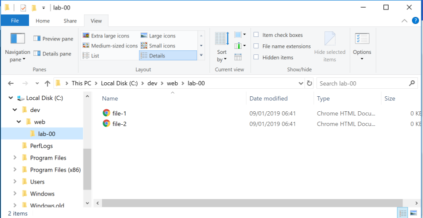
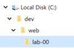
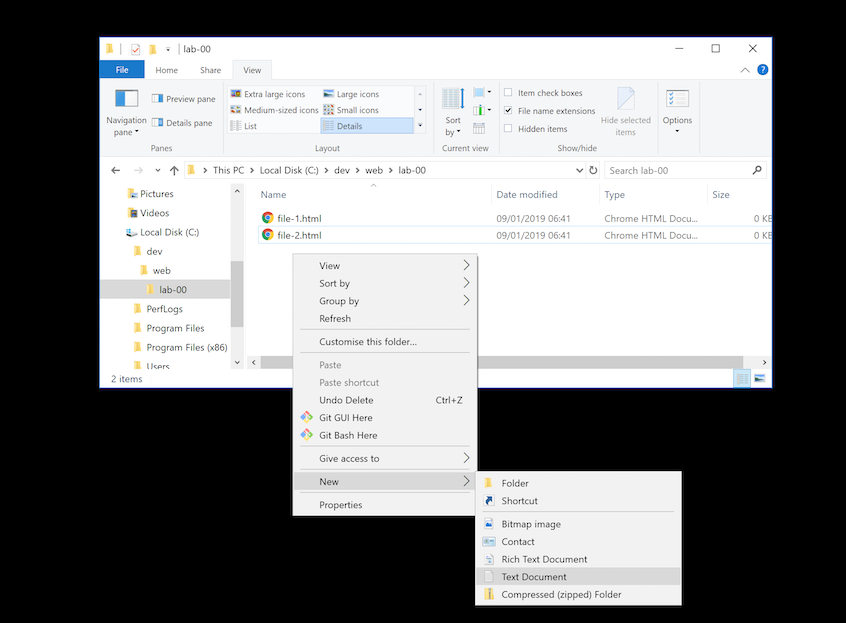
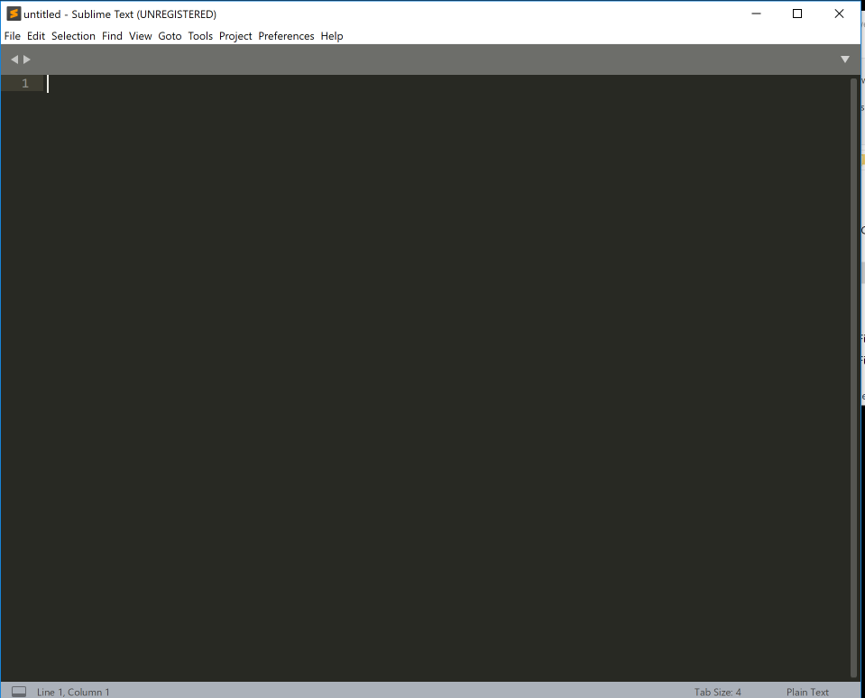
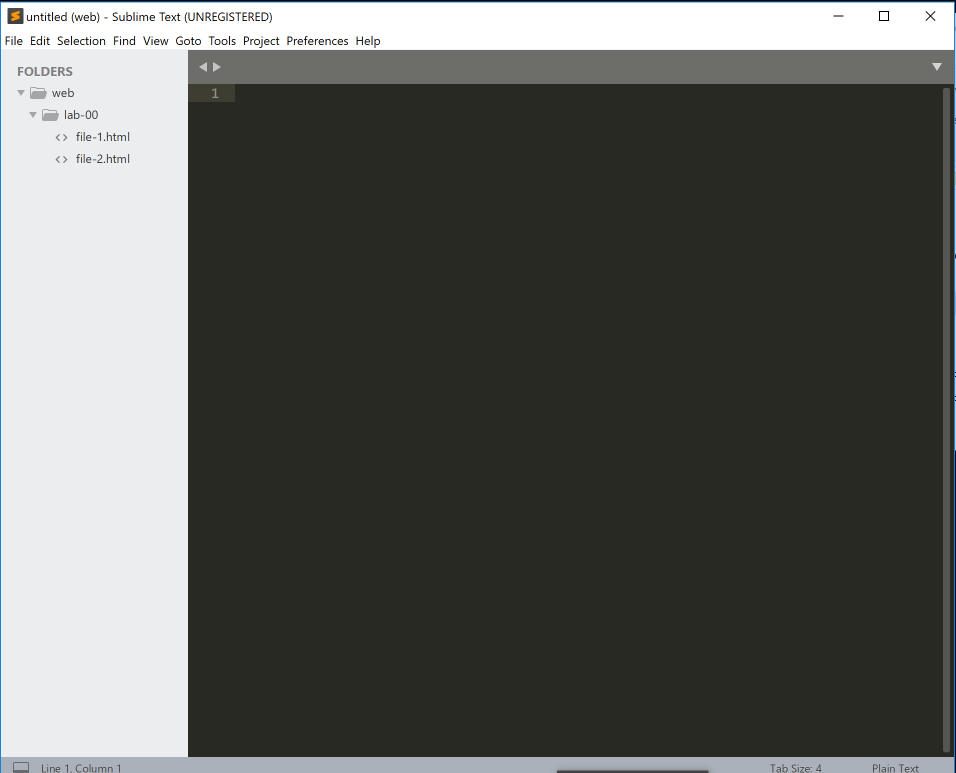

#Tips and Hints

When working on windows - an important setting in the File Explorer tool is to always reveal the `file name extensions` of files when browsing the file system. 

## File Explorer Configuration 

Open File Explorer now on Windows - locate and show the `ribbon` (the panel with buttons along the top)

Then, select the `file name extensions` item, and notice the subtle change on the way file1 and file2 are represented.

## Creating Folders

With this setting in place, now create the following folder structure on your workstation:

That is, we have created

- a folder called `dev` on the C: drive, 
- a folder `web` inside that
- another folder `lab-00` in `web`.

You should be able to do all of this from within file File Explore itself.

## Creating Files

Create some empty files in lab-00 - called `file-1.html` and `file-2.html`

One way of doing this is to create the files from inside the file explorer windows via a right mouse click:

In the above, notice that we are selecting "Text Document" as the file type. Also notice that we rename the files we create to 'file-1.html' and 'file-2.html' form the default name windows suggests.

See if you can replicate the above precisely.

## Editing in Sublime

With this folder structure created, we an open Sublime

Then we open the `web` folder so that the folder + subfolders and files are visible from a side bar in Sublime:

There are a number of ways of enabling this view. One way is to `drag and drop` the web folder onto the sublime canvas. The sidebar may appear immediately - or you may need to specifically show it via the `view->sidebar` menu option.

You should now be able to select and edit any file in the folders. Try it now and verify that you can enter some random text, save the files, close and reopen sublime to verify that the contents have been retained.

It is important to regularly save your work. In sublime if you go to close your files it will prompt you to see if you want to save your work (if it has changed). However better practice to regularly save as you work.