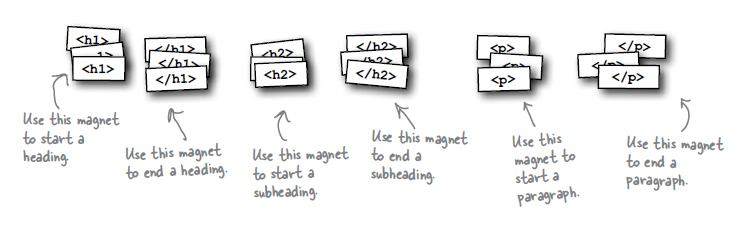

# First HTML Tags

HTML gives you a way to tell the browser about the structure of your page. What's structure? It is a way of marking up your text so that the browser knows what's a heading, what text is a paragraph, what text is a subheading and so on. Once the browser knows a little about the structure, it can display your page in a more meaningful and readable manner.

You could imagine the tags as Fridge Magnets - we are going to use the decorate the page we created:

The tags shown in the image above are used to place structure to the content we typed. So we want to identify which content is a heading, which is a subheading and which is a paragraph.

If we first identify the heading, it is clearly the first line in our content : `Starbuzz Coffee Beverages`. Next a paragraph could be `A smooth, mild blend of coffees from Mexico, Bolivia and Guatemala.`

Using the tags we surround each piece of content as suggested above, This is what the page should look like in Sublime:

Save your work, and now open/refresh our web page in the web browser:

Compare this with the way the browser displayed the file in the last step:

