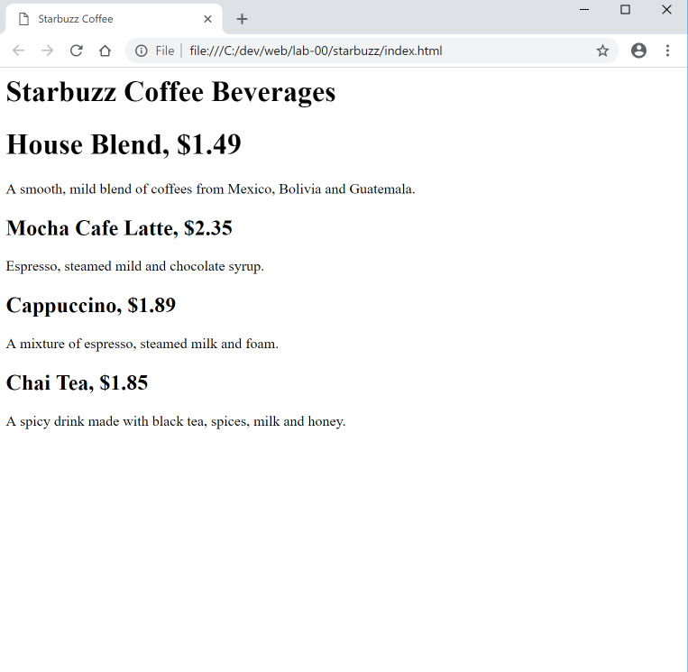

#More HTML

You now have an HTML file with markup - does that make a web page? Almost.  You will be introduced to the following tags in the lectures:

- `<html>` 
- `<head>` 
- `<title>` 
- `<body>`

Here is a revised structure for the page:

Modify your file to match the above structure and save it.

Now refresh the Chrome browser to see the changes.

There is no change in the 'canvas' - however, notice that the window header now has "Starbuzz Coffee" instead of just "index.html"

Congratulations you have now completed your first web page. 