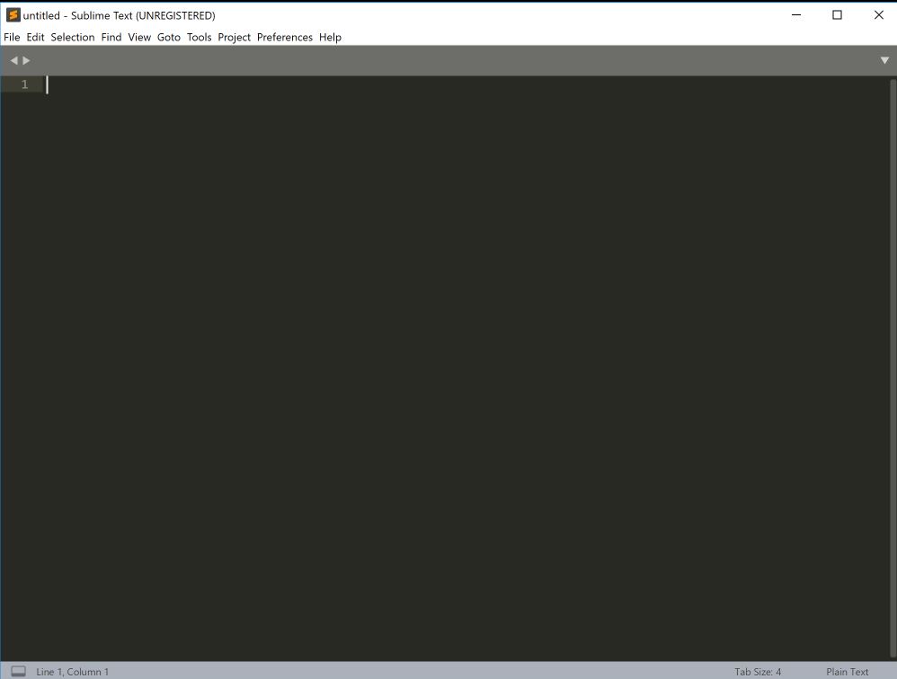
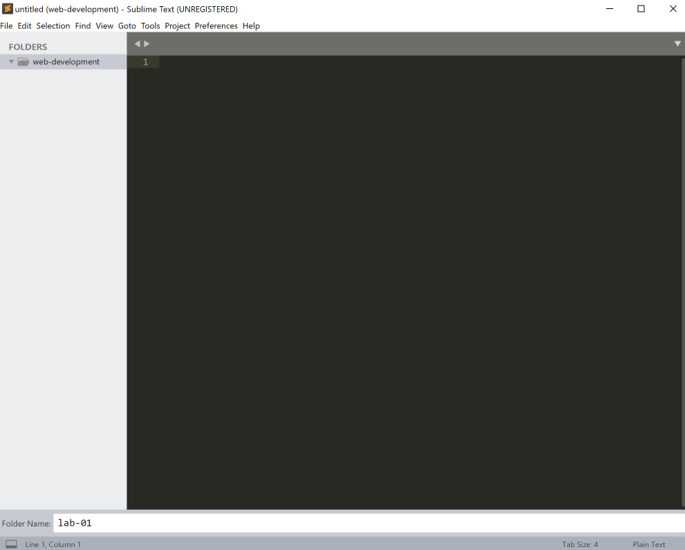
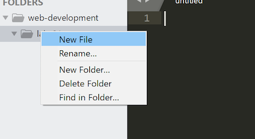
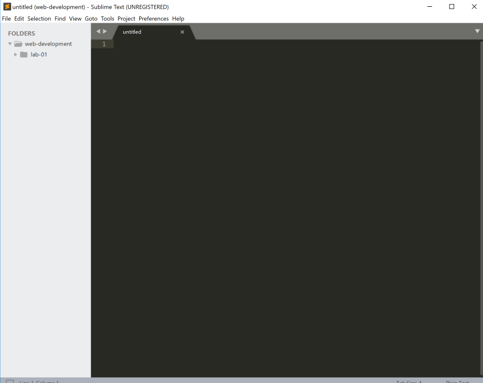
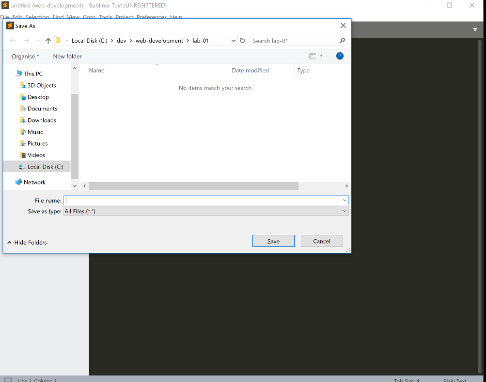
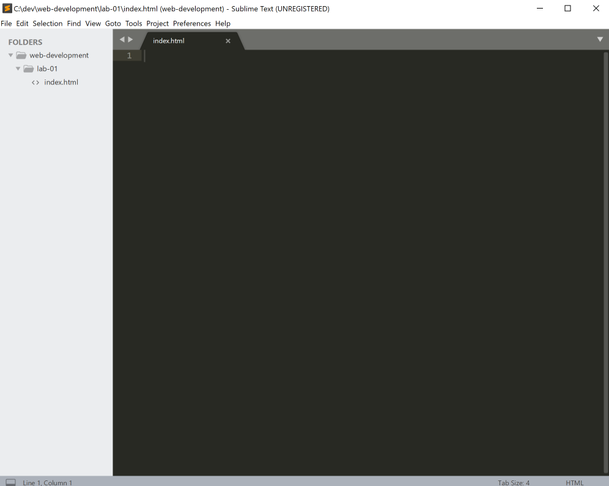
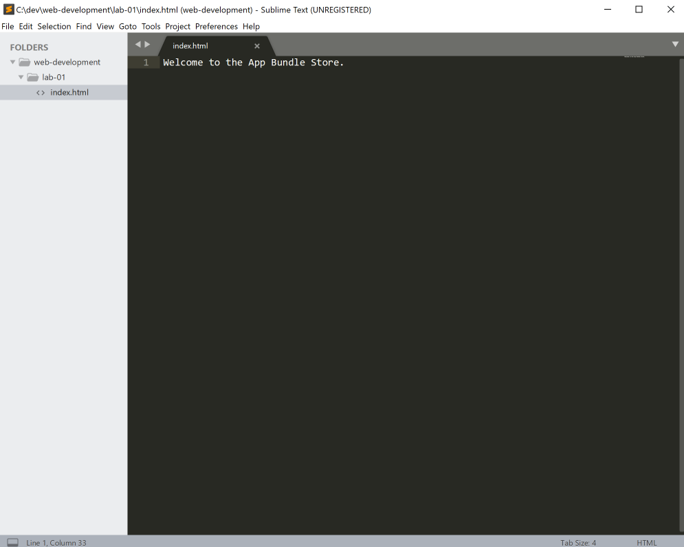
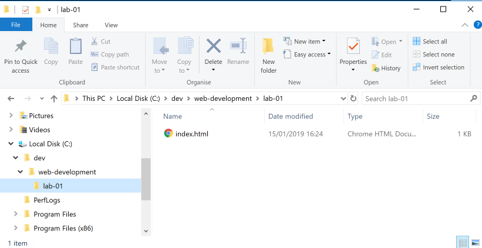
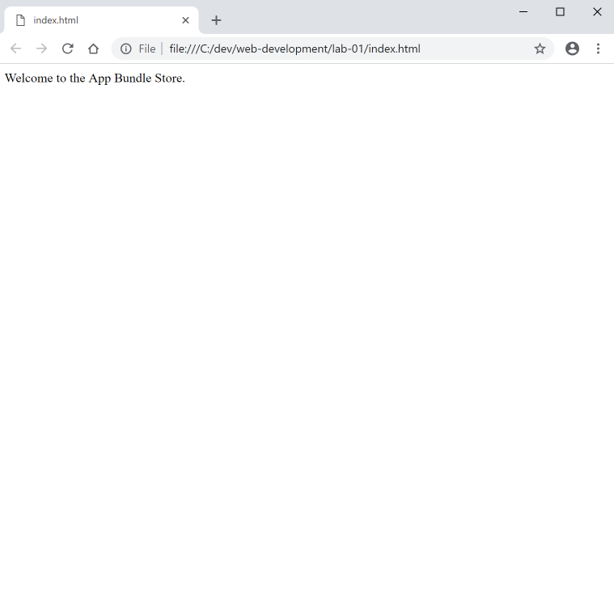
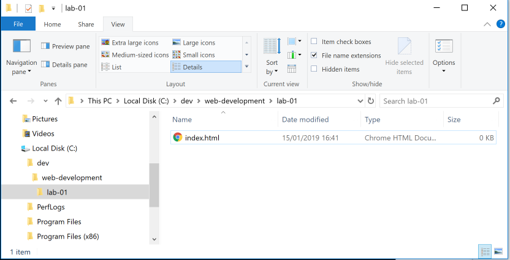

# Project Setup

Consider creating a folder structure for your labs - starting with a folder called `web-development`. 

You can do this any number of ways - but the simplest might be using File Explorer (Windows) or Finder (Mac). This folder can be located anywhere convenient - but make sure you know where it is on the file system. One useful location is `C:` on Windows. On Mac, your home folder. Alternatively, you might create the folder on the desktop - however this is perhaps not the best longer term location.

Students sometimes create folders like this on a folder located in Dropbox - this has the advantage that it will be continually backed up in case of an issue later.

Wherever you choose - launch Sublime Text to start the lab:

Open Sublime and choose `Open Folder` from the File menu, navigate to the `web-development` folder you have just created and click `Open Folder`.

Alternatively, just drag and drop using File Explorer (or Finder in mac) the `web-development` folder directly onto the Sublime window.

In Sublime click on the `web-development` folder, right click - and select `New Folder`. Enter the folder name `lab-01` (this appears at the foot of the sublime menu as shown below):

Press return, and the sidebar should reveal the new folder you have created:

Now, select the `lab-01` folder - and select Right-Click on the mouse. This brings up a Context menu:

Select New File - and this will create a new file:

Notice that the title in the file is 'untitled'. Select `Save` on the File menu and name the file `index.html`. This may bring up a dialog to help you locate and name the file.

Give the file the name index.html.

Make sure the file is saved into the `web-development/lab-01` folder as shown above (this should be the default).

Once the file is saved, then Sublime should look like this:

Look carefully at the side bar - and make sure yours looks identical.

Now, copy paste the text below into the index.html file:

~~~
Welcome to the App Bundle Store
~~~

Now, using the File Explorer (or Finder on mac), browse to the project and its contents:

Depending on which is your default browser - opening this file (by double clicking) will let you view the file in that browser:

Note, you do not need to create files/folders from within Sublime, you can do the same using File Explorer/Finder if you wish. The sublime sidebar will be updated automatically.

One final point - make sure the, in File Explorer, the full name is visible (including the .html component). If this is not, then locate the "File name extension" setting in File Explorer:

... and make sure it is selected (as shown).

That is a lot of steps! However, once you get used to manipulating files/folders this will become easier. If this type of interaction is new to you, perhaps consider deleting everything you have created so far, and redo it again to gain some practice time.
