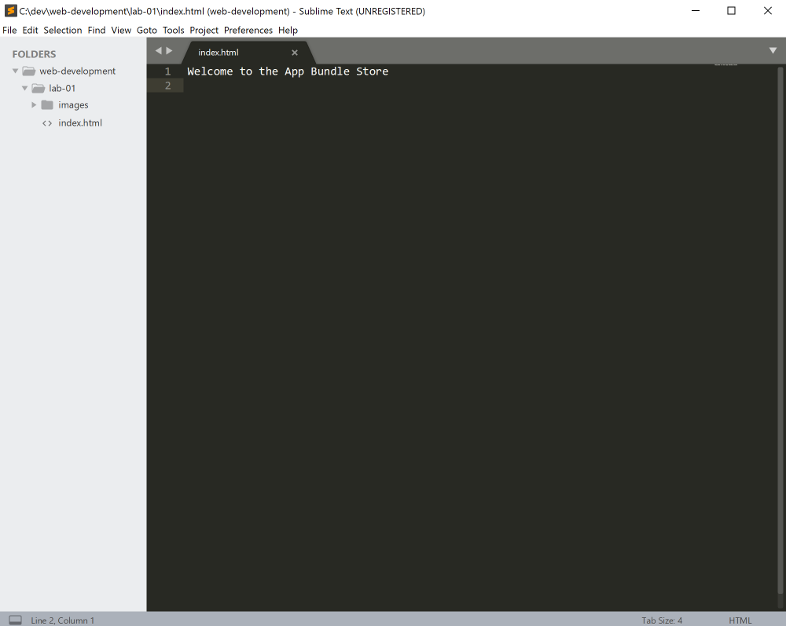
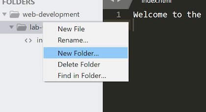
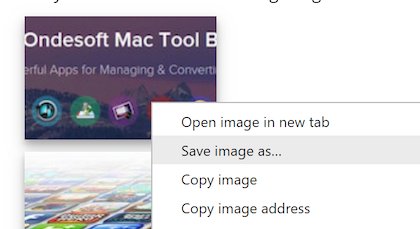

## Downloading Images

Using techniques from the previous step, create a new folder inside the lab-01 folder in your project called "images". Sublime might look like this:

All you need to do is right-click on the "lab-01" folder in sublime, and select "New Folder" from the context menu - name the folder "images"

# Image Library

Below are two images:

Right click on each one of these now (in the browser you are reading this on) and select "Save Image As". 

It brings up a dialog inviting you to locate the folder, and name the file, you are about to save. 

Your task now is to locate the "web-development/lab-01/images" folder you have just created, and save the files in there. The files will have a default name, which you can keep.

If all of the above goes as expected, you your sublime window should look like this:

The logical structure of your project is something like this now:

~~~csv
web-development
     └── lab-01
        ├── images
        │   ├── banner.png
        │   └── ondesoft.jpg
        └── index.html
~~~

See if you can verify that this is the structure visually using File Explorer / Finder.