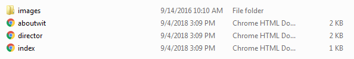

##Linking within your own site 

If the file you want to link to is on your computer (or on the same website), you just need to provide the filename (plus extension) as the URL. For example: 

~~~
<a href="index.html">Home Page</a> 
<a href="aboutwit.html">About WIT</a> 
<a href="director.html">Director</a> 
~~~

All of these pages are saved in the same folder, as you can see here: 

Note that if the pages were saved in different folders, you would need to include the full path (i.e. the location of the file) so that the browser would be able to find it! For now, just make sure that all the pages you want to link are saved in the same folder. 

<a href="archives/examples/cv.html" target="_blank">Link Example</a>