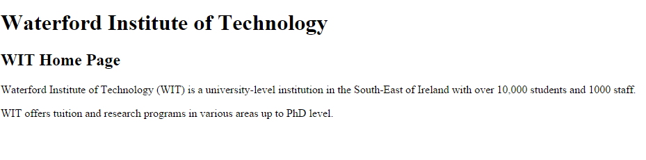
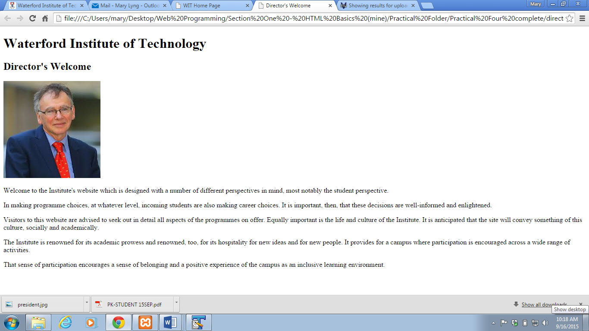
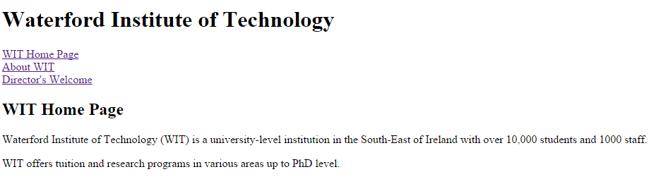
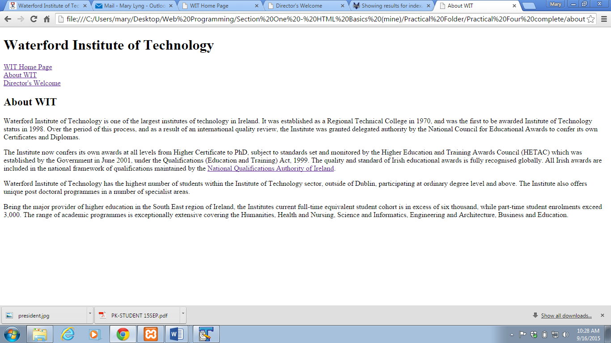

##Linking pages: Exercise

- Download this zip file into your WebsiteDevelopment1/Week01 folder: [lab04.zip](archives/lab04.zip)
- Extract/unzip the file (if you right-click on the file, you will usually see an 'extract here' option which is the easiest way to do this! If you're unsure, please ask your tutor.)
- Open the three HTML pages in your text editor. Then, carry out the following instructions.

###On each page

- Markup the first line of each web page (Waterford Institute of Technology) as a `<h1>` heading. 
- Markup the second line of each web page (WIT Home Page, About WIT, Director’s Welcome) as a `<h2>` heading. 

###On the director.html page

- After the **h2** heading, add the image of the director to director.html. The image (president.jpg) is in the images sub folder.

###Add links between the pages

- Link the 3 pages together. Place the links after the **h1** heading but before the **h2** heading. The files required for the links are: **index.html**, 
**aboutwit.html**, and **director.html**. Add a &lt;br&gt; tag after each link (to force a line break).

###Add an external link (on aboutwit.htm)

- Add an external link for the National Qualifications Authority of Ireland at the end of the second paragraph in the **aboutwit.html** page. 
The link (web address) is `http://www.qqi.ie`. 
- Add the attribute-value **target="_blank"** to the link (a tag).

