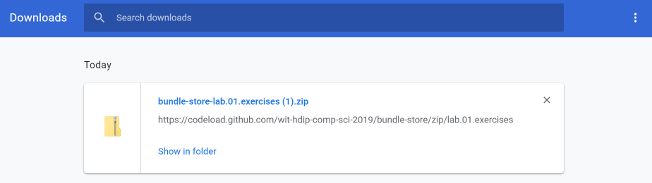
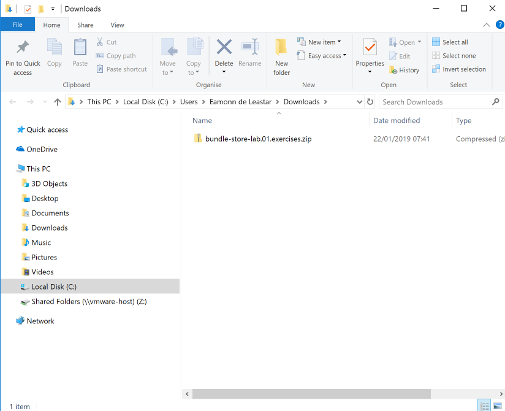
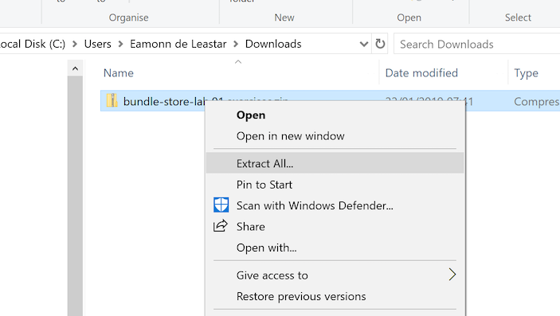
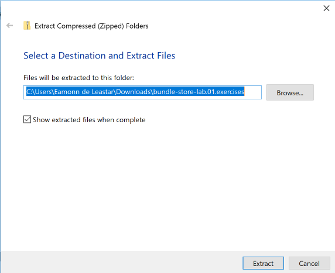
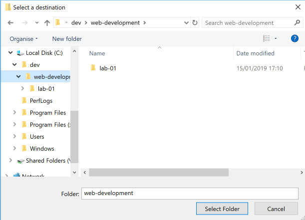
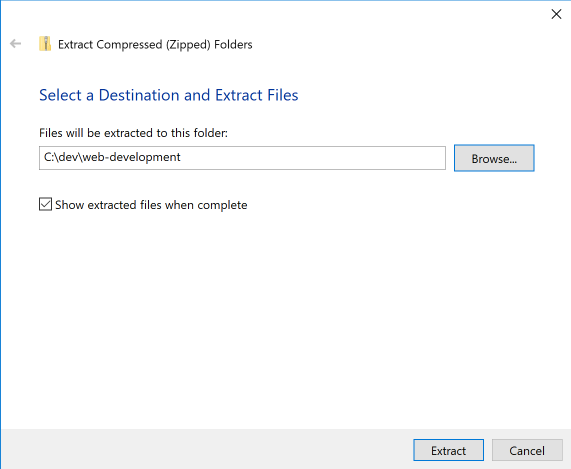
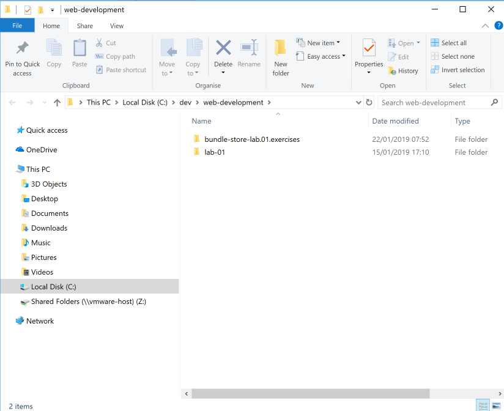
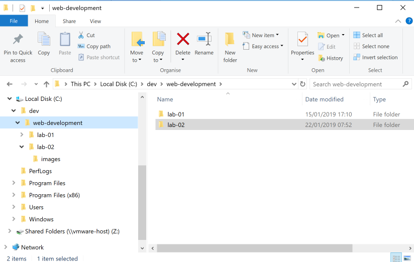

# Setup

This lab we are going to download and unzip/unarchive a starter project:

- <https://github.com/wit-hdip-comp-sci-2020/bundle-store/releases/tag/lab.01.exercises>

We will use this project as the starting point for this lab. This project is an evolution of lab-01 as completed last week, but augmented with a small number of additions prompted by the exercises.

To download the project, visit the above page and select the source code (zip) link:

If using chrome, you will see an indication along the base of the window if the file downloaded:

Selecting "Show All" will give you a more detailed view:

Then select "Show in Folder"

Now select the archive itself - and Right Click:

Select "Extract All as shown above.

Windows will then present a choice of locations to extract the archive.

By pressing 'Browse', navigate to where you may have been working in last weeks lab - in this example C:/web-development:

Now proceed to extract the file here:

The folder structure may resemble this once the extraction has completed:

Finally, rename the folder from "bundle-store-lab.01.exercises" to simply "lab-01"

Switching to Sublime now, open the Web Development folder, and both projects (lab-01 and lab-02) should be visible:

Open and explore the lab-02 project in a browser. It is similar to lab-01, with a small number of extra features (inspired by the exercises from last week).