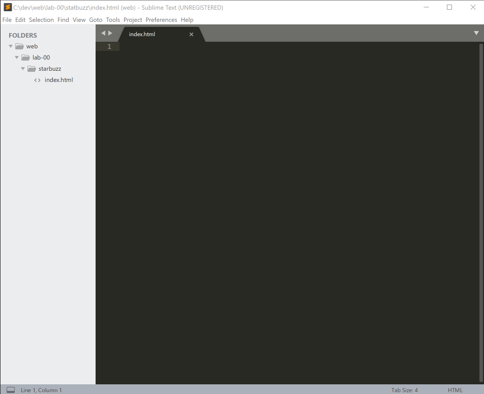
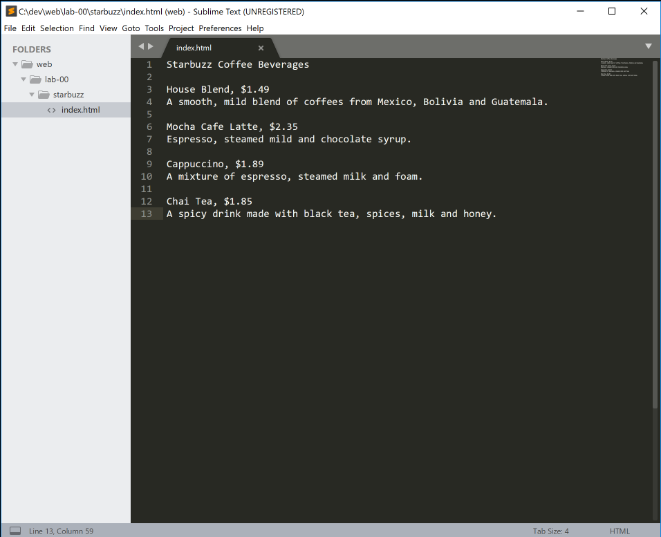
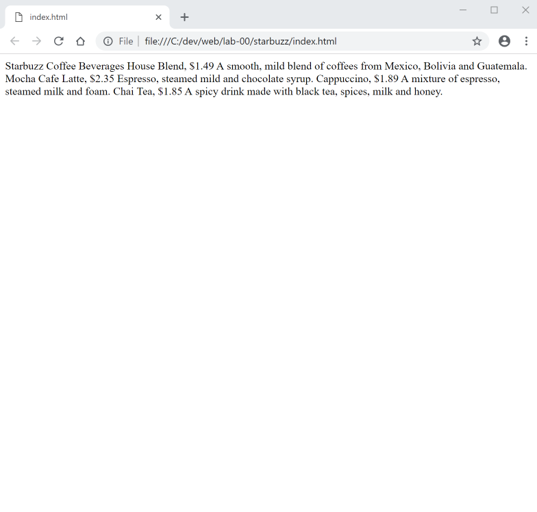

#Introduction Project

You will create a simple web page for it Starbuzz Coffee shop. The brief for the project has been sketched on a napkin!

These are the steps you should carry out:

- Create a folder for the project called `starbuzz`
- Inside the folder, create a file called `index.html`

Here is how Sublime might look if you do the above:

Now we enter the following contents into the (blank) index.html file:

~~~
Starbuzz Coffee Beverages

House Blend, $1.49
A smooth, mild blend of coffees from Mexico, Bolivia and Guatemala.

Mocha Cafe Latte, $2.35
Espresso, steamed mild and chocolate syrup.

Cappuccino, $1.89
A mixture of espresso, steamed milk and foam.

Chai Tea, $1.85
A spicy drink made with black tea, spices, milk and honey.

~~~

You can copy/paste the above text - no need to enter it manually. Your editor may look like this:

Now, we would like to view the file we have just saved using a web browser (Chrome in this case). This can normally be done just by double clicking on the file in Explorer:

This is a web rendering of the file we created. It doesnt look very pretty -  we will improve it in the next step...

