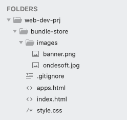
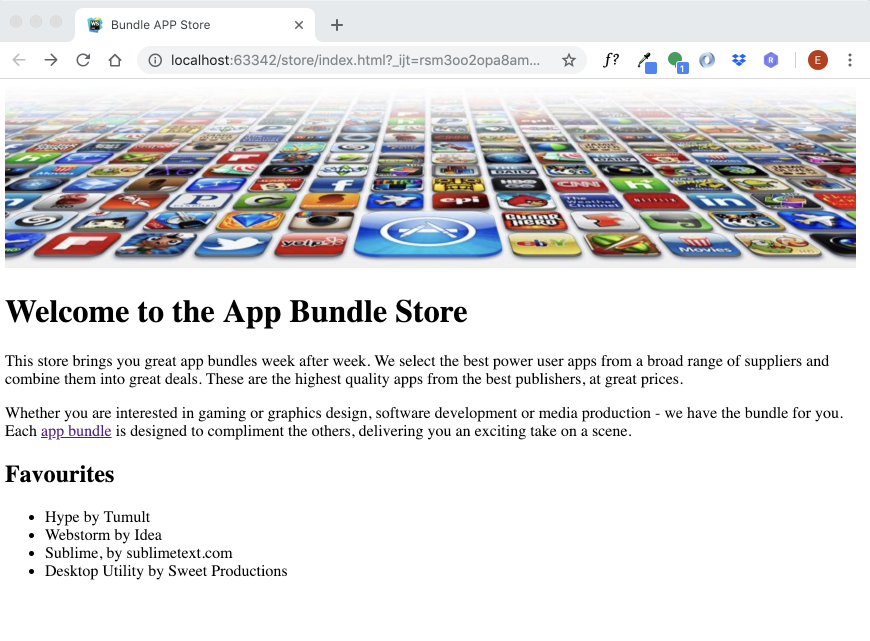

#HTML pages

We are going to create a web site that is based on the Google Play site or the Apple app store. It will present apps, music, and movies to the user.

Choose New File from the File menu, to create another new file called  `apps.html`

You should now have the following folder and file structure visible in Sublime:

Make sure your sublime matches the above precisely.

Next you will write some html code into the two html files. 

Copy and paste in the following code into each of the files:

##index.html
~~~
<!DOCTYPE HTML>
<html>
  <head>
    <title>Bundle APP Store</title>
  </head>
  <body>
    
    <h1>Welcome to the App Bundle Store</h1>
    

      This store brings you great app bundles week after week. We select the best power user apps from a
      broad range of suppliers and combine them into great deals. These are the highest quality apps
      from the best publishers, at great prices.
    

    

      Whether you are interested in gaming or graphics design, software development or media production
      - we have the bundle for you. Each <a href="apps.html">app bundle</a> is designed
      to compliment the others, delivering you an exciting take on a scene.
    

    <h2>Favourites</h2>
    <ul>
      <li>Hype by Tumult</li>
      <li>Webstorm by Idea</li>
      <li>Sublime, by sublimetext.com</li>
      <li>Desktop Utility by Sweet Productions</li>
    </ul>
  </body>
</html>
~~~

##apps.html

~~~
<!DOCTYPE HTML>
<html>
  <head>
    <title>Bundle APP Store</title>
  </head>
  <body>
    
    <h3>Freebie</h3>
    

      Stacksocial just published its so called Free Ondesoft Mac Tool Bundle, which contains 5 apps
      from Onesoft. The bundle is worth $146 will be probably available only a couple of days so you’d
      better hurry up to get it.
    

    

      
    

    

    

    <h3>Macware Business Bundle</h3>
    

      Here comes the next bundle for march. This time its macware who publish a bundle.
      The so called macware Business Bundle contains 6 apps at a price of only 29.99 instead of
      199.94. So you can save around 84%.
    

  </body>
</html>
~~~

Remember to save your files in sublime by clicking File -> Save

As we did in step 1, open both file using the default web browser in your workstation.

Do the pages look more or less as above?

Specifically:

- Do the images display correctly?
- Does the link in the index page work, opening the apps page from the index page? The link is embedded in the second paragraph.
- If you navigate from index to app, how do you get back?

