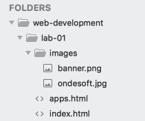

# CSS

We will now introduce a stylesheet into our project. Stylesheets are usually maintained in separate files with the .css extension. Choose New File from the File menu and name it `style.css`. 

The folder structure now looks like this:

Make sure this file is in the `lab-01` folder - and not in the `images` folder. This can be hard to see exactly in sublime - so consult Explore/Finder to make sure it is in the correct location.

We bind this file into the project by 'linking' it to our home page. This must be incorporated into the `<head`> element of each page. Currently index.html head section looks like this:

~~~html
  <head>
    <title>Bundle APP Store</title>
  </head>
~~~

We can extend it with a new element to link to the stylesheet. The head section of the index.html home page should now look like this:

~~~html
  <head>
    <title>Bundle APP Store</title>
    <link rel="stylesheet" href="style.css">
  </head>
~~~

Save your files and open the index.html page in your browser and keep this window open. There is no visible effect on our page yet until we introduce a rule into the stylesheet. 

Type all of the following into the style.css file (note the American spelling of the word color) :

~~~css
h1 {
  color: red;
}
~~~

Save all your files. Refresh the index page in your browser and see the result of writing this one css rule.

The header is now red.

Remove the css rule you have just introduced and replace it with this one:

~~~css
body {
  font-family:sans-serif;
}
~~~

Refresh the browser view - and verify visually that the font has changed. If you are finding it hard to spot, remove the rule again - save and refresh - until you can see the difference.

Now append these rules - and review the effect on the rendered pages:

~~~css
h1, h2
{
  color: gray
}

h1 {
  border-bottom: 1px solid black;
}
~~~

Your css file now looks like this:

~~~
body {
  font-family: sans-serif;
}

h1, h2 {
  color: gray
}

h1 {
  border-bottom: 1px solid black;
}
~~~

