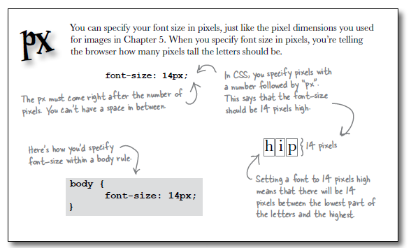
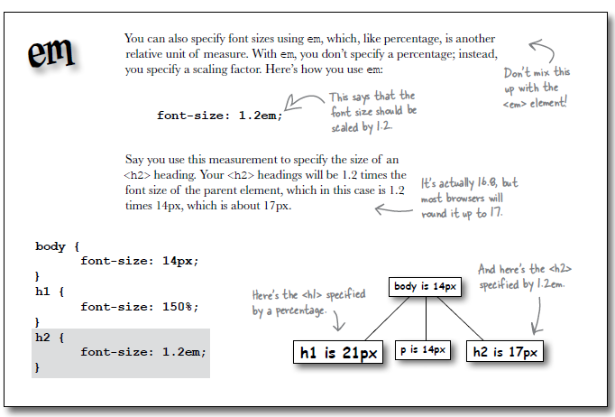
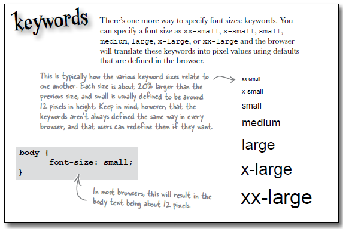
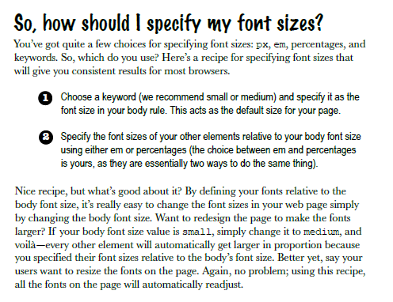

# Fonts

## Font families

The font-family CSS property specifies a prioritized list of one or more font family names and/or generic family names for the selected element.

- <https://developer.mozilla.org/en-US/docs/Web/CSS/font-family>

Fonts are not consistently available from one computer to another. The available fonts depends on the operating system as well as the fonts and applications that a user has installed. Here's a an example of how to use font-family:

~~~css
body {
  font-family: Verdana, Helvetica, Arial, sans-serif;
}
~~~

The font-family property provides you with a list of preferred fonts. The idea is that most browsers will have your first choice, in this case Verdana, but if none of the specific fonts can be found then the browser uses its default "sans-serif" font. Always put a generic font family name at the end, like "serif" or "sans-serif". Experiment with these in the your style sheet.

## Font Weight

The font weight property allows you to control how bold the text looks. Bold text looks darker than normal text and tends to be a bit fatter too. You can make any element use bold text by setting the font-weight property to bold.

~~~css
p {
  font-weight: bold;
}
~~~

## Font sizes

Often the default sizes for headings can be a bit large. To change these defaults, we have four general techniques:

### 1. Specifying using Pixels.

You can specify a font size in pixels. When you specify font size in pixels, you are telling the browser how many pixels tall the letters should be.

~~~css
body {
  font-size: 14px;
}
~~~

The px must come directly after the number, there cannot be a space between them.

### 2. Specifying using Percentage.

Unlike pixels, which tell the font exactly how big it should be in pixels, a font size specified as a percentage tells the font how big it should be relative to another font size.

~~~css
h1 {
  font-size: 150%;
}
~~~

This says that the font size should be 150% of another font size. Font-size is a property that is inherited from the parent element, when you specify a % font size it is relative to the parent element. `<h1>` inherits from body so `<h1>` headings will be 150% of 14px.

### 3. Specifying using "em".

This like percentage is another unit of measure. With em you don't specify a percentage, instead you specify a scaling factor.

~~~css
h2 {
  font-size: 1.2em;
}
~~~

If you use this to specify a `<h2>` heading your `<h2>` headings will be 1.2 times the font size of the parent element, which in this case is 1.2 times 14px, which is about 17px.

##4. Specifying using keywords.

You can specify a font size as xx-small, x-small,small,medium, large, x-large, or xx-large and the browser will translate these keywords into pixel values using defaults that are set in the browser.

~~~css
body {
  font-size: small;
}
~~~

## Font Rules

Suppose we wanted to have the following font characteristics - 

~~~css
body {
  font-size: small;
}

h1 {
  font-size: 150%;
}

h2 {
  font-size: 130%;
}
~~~

We can append the above to our existing style sheet, so the complete file looks like this:

~~~
body {
  font-family: Verdana, Helvetica, Arial, sans-serif;
}

h1, h2 {
  color: gray
}

h1 {
  border-bottom: 1px solid black;
}

em {
  color:red;
}

body {
  font-size: small;
}

h1 {
  font-size: 150%;
}

h2 {
  font-size: 130%;
}
~~~

Reload the page to make sure it is in effect. Looking again at the stylesheet, compare it with this version:

~~~
body {
  font-family: Verdana, Helvetica, Arial, sans-serif;
  font-size: small;
}

h1, h2 {
  color: gray;
}

h1 {
  border-bottom: 1px solid black;
  font-size: 150%;
}

em {
  color: red;
}

h2 {
  font-size: 130%;
}
~~~

Can you see the difference? There will be no change in how the page appears - however, the second version of the style sheet is expressed more concisely - we have merged some of the rules as appropriate.
