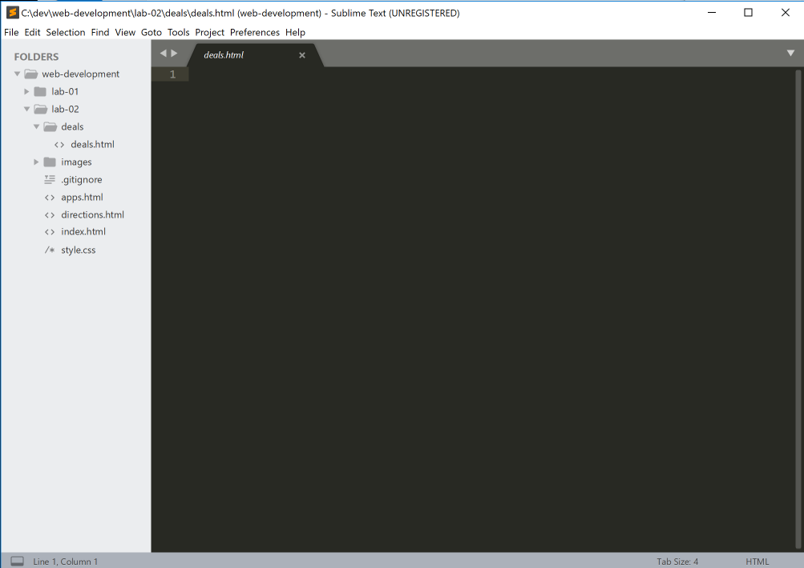
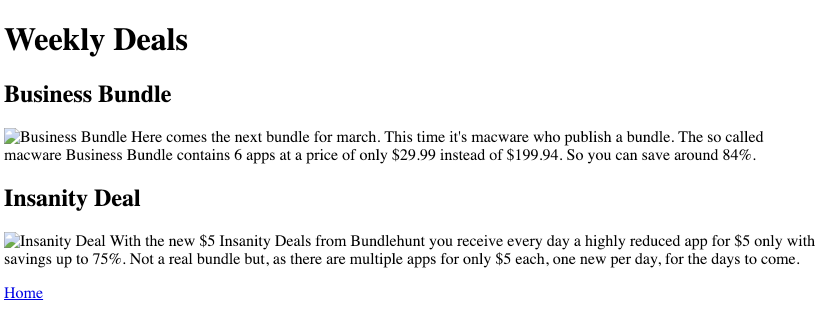
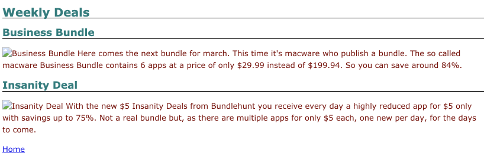

# Relative Paths I

Create a new folder called deals inside the lab-01 folder. In that folder create a new page name it deals.html. You can use sublime to create both the folder and the file.

Put the following code into the page and save.

~~~
<!DOCTYPE html>
<html>
  <head>
    <title>App Bundle Deals</title>
    <link rel="stylesheet" href="style.css">
  </head>
  <body>
    <h1>Weekly Deals</h1>
    <h2>Business Bundle</h2>
    

       Here comes the
      next bundle for march. This time it's macware who publish a bundle. The so
      called macware Business Bundle contains 6 apps at a price of only $29.99
      instead of $199.94. So you can save around 84%.
    

    <h2>Insanity Deal</h2>
    

       With the new $5
      Insanity Deals from Bundlehunt you receive every day a highly reduced app
      for $5 only with savings up to 75%. Not a real bundle but, as there are
      multiple apps for only $5 each, one new per day, for the days to come.
    

    <a href="index.html">Home</a>
  </body>
</html>
~~~

Open the page in a browser:

Notice that the page is not consistent with the other styles we have evolved - and also that the images do not seem to be appearing. First, lets fix the style problem:

~~~
    <link rel="stylesheet" href="style.css">
~~~

This link is failing - because the "style.css" is not in this "deals" folder, it is in the parent. Change it as follows:

~~~
    <link rel="stylesheet" href="../style.css">
~~~

Reload the page:

We have used the ".." notation to navigate up to the parent directory of 'deals' and link to the style.css file located there.

There are a number of other issues with the page - we can fix in the next step.