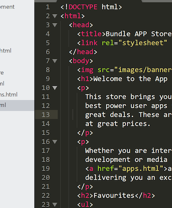
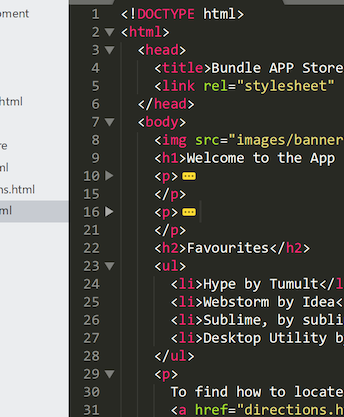

# Indentation

We should carefully inspect our html and verify that we are laying it out correctly, and in particular that we are obeying consistent indentation rules in the structure of the html itself.

Indentation is simply a consistent placement of spaces before each element, such that it flows in an ordered manner reflecting the opening/closing of tags. We prefer to use 2 spaces for each 'level'.

###Example Inconsistent indentation:

~~~html
   <html>
  <head>
    <title>APP Store</title> <link type="text/css" rel="stylesheet" href="style.css" media="screen" />  </head>
  <body>
    <h1>Score: Apps, Movies, Music, Books
    </h1><ol> <li><a href="apps.html">Apps</a></li>
      <li><a href="music.html">Music</a></li>
      <li><a href="movies.html">Movies</a></li>    </ol>
    <h2>New Games</h2>
    <ul>      <li>Clear All</li>
      <li>Google Box</li>
      <li>Squinks</li>    </ul>
     </body>
</html>
~~~

###Example Correct indentation

~~~html
<html>
  <head>
    <title>APP Store</title>
    <link type="text/css" rel="stylesheet" href="style.css" media="screen" />
  </head>
  <body>
    <h1>Score: Apps, Movies, Music, Books</h1>
    <ol>
      <li><a href="apps.html">Apps</a></li>
      <li><a href="music.html">Music</a></li>
      <li><a href="movies.html">Movies</a></li>
    </ol>
    <h2>New Games</h2>
    <ul>
      <li>Clear All</li>
      <li>Google Box</li>
      <li>Squinks</li>
    </ul>
  </body>
</html>
~~~

Review your index.html file and ensure that it is correctly indented. One quick way to determine this is to 'fold' all the elements in the editor. To do this, hover the mouse beside the numbers listed in the left hand margin, downward arrows will appear. By clicking on the arrows the code will expand and collapse.

This will change your editing view something like this:

Take the opportunity now to line up all elements consistently. This can be tedious, and there are tools to do this automatically, but do it manually for the moment.
