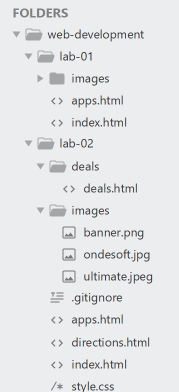
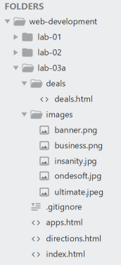
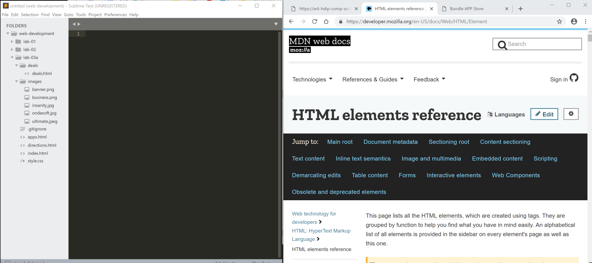

#Setup

This week we will start a new project, and we will seed it with the project as we completed it last week. Your web development workspace might look like this (if opened as a Sublime folder):

This is the project as we left it last week (including some extra material prompted by the exercises):

- <https://github.com/wit-hdip-comp-sci-2019/bundle-store/releases/tag/lab.02.exercises>

Create a new folder called lab-03a now, and either:

- unzip the solution above OR
- duplicate your lab-02 project (if you completed the exercises)

Either way, this is how the workspace should look like now:

If you have room, also open the Chrome web browser side by side:

In the above, we are keeping a tab of the browser open at

- Our Lab instructions (this page)
- The HTML Reference (MDN) <https://developer.mozilla.org/en-US/docs/Web/HTML/Element>
- The index.html in lab-03a

The Mozilla foundation are an excellent source of reference information on all things web - and it is useful to keep the html reference site open to occasionally check that your are using the correct structure for your elements.
