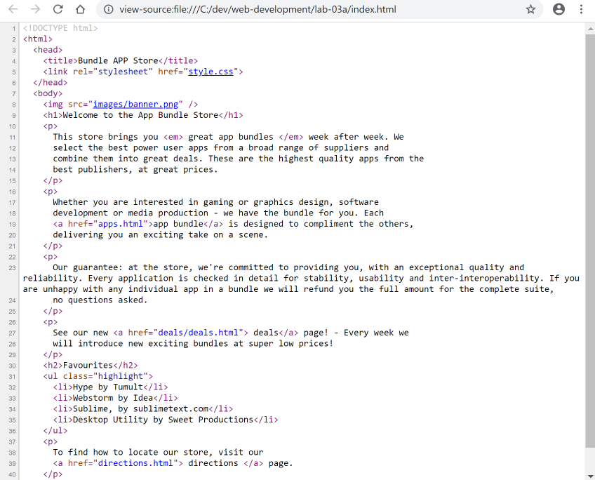
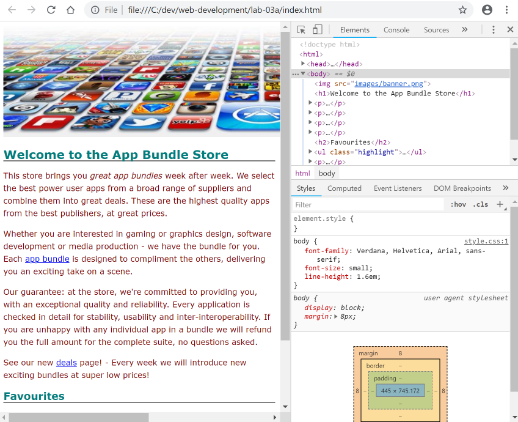
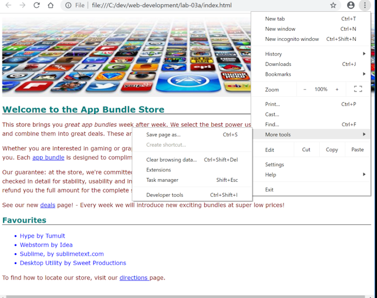

#Main page

##lab-03a/index.html

Open the main index.html page and introduce the following as the third paragraph on the page:

~~~html
   

      Our guarantee: at the store, we're committed to providing you,
      with an exceptional quality and reliability. Every application is checked in detail
      for stability, usability and inter-interoperability. If you are unhappy with any
      individual app in a bundle we will refund you the full amount for the complete suite,
      no questions asked.
    

~~~

... and open this same file in the browser:

Any change you make in the sublime will only appear in the browser if you:

- save the changes in sublime
- refresh the page in chrome.

Additionally, chrome has some interesting features to let you explore the page 'source'. The simplest one is to just right click anywhere in the browsers and select `View Source`:

A more sophisticated option is to use `Developer Tools`:

To reproduce the above, first close the `source` view we just opened above, and proceed to access the tools as shown here:

Explore the developer tools for a little while - notice how the `box model` seems to be visible. Then close it, we will return to it later.
