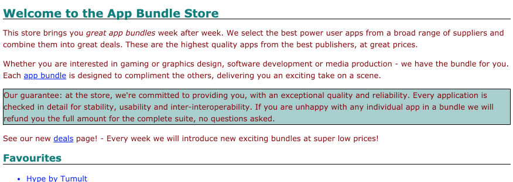
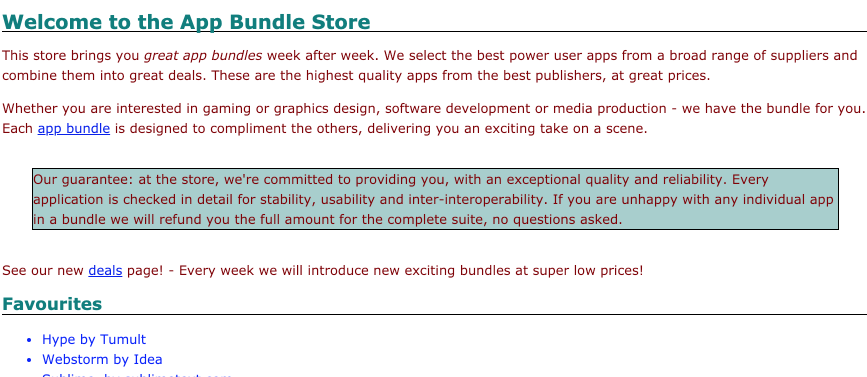

#Guarantee Paragraph

Locate the 'guarantee' paragraph in the home page (the third paragraph we just inserted):

~~~html
    

      Our guarantee: at the store, we're committed to providing you,
      with an exceptional quality and reliability. Every application is checked in detail
      for stability, usability and inter-interoperability. If you are unhappy with any
      individual app in a bundle we will refund you the full amount for the complete suite,
      no questions asked.
    

~~~

We would like to target this specific paragraph with some custom styles. To this end, we nominate it to a 'class' called 'guarantee':

~~~html
    

      Our guarantee: at the store, we're committed to providing you,
      with an exceptional quality and reliability. Every application is checked in detail
      for stability, usability and inter-interoperability. If you are unhappy with any
      individual app in a bundle we will refund you the full amount for the complete suite,
      no questions asked.
    

~~~

In our style sheet, we can devise a rule just for this paragraph:

~~~css
.guarantee {
  border-color: black;
  border-width: 1px;
  border-style: solid;
  background-color: #a7cece;
}
~~~

Append this rule to the end of the style.css file, and reload and review how the paragraph looks:

We can see evidence of our targeted styles.

We can add a little margin:

~~~css
.guarantee
{
  ...
  margin: 30px;
}
~~~

Note that `...` above means leave the existing properties in place and just add the `margin` to the end of the `'guarantee` rule.

Reload the page:

Notice the box model property coming into effect.
