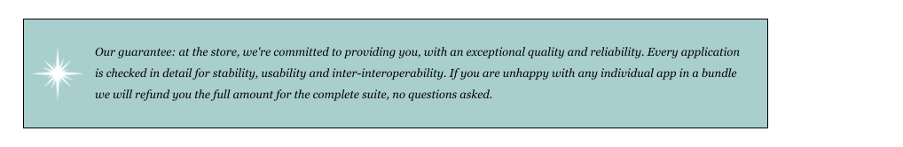

# Line height, font and borders

Still working on the guarantee rule, some further adjustments to the text itself:

~~~css
  line-height: 1.9em;
  font-style: italic;
  font-family: Georgia, "Times New Roman", Times, serif;
  color: black;
~~~

Finally, we might adjust the border pattern:

~~~css
  border-color: white;
  border-width: 1px;
  border-style: dashed;
~~~

Which turns out as:

Regrouping the properties, this is the complete rule:

~~~css
.guarantee {
  border-color: black;
  border-width: 1px;
  border-style: solid;

  background-color: #a7cece;
  background-image: url(images/background.gif);
  background-repeat: no-repeat;
  background-position: left;

  margin: 30px;
  padding: 25px;
  padding-left: 80px;
  margin-right: 150px;

  line-height: 1.9em;
  font-style: italic;
  font-family: Georgia, "Times New Roman", Times, serif;
  color: black;

  border-color: white;
  border-width: 1px;
  border-style: dashed;
}
~~~

