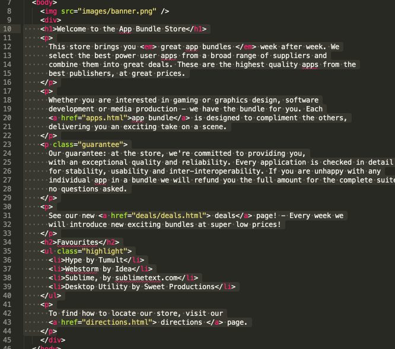
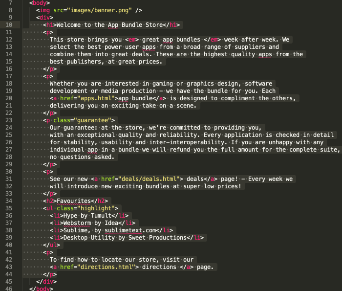
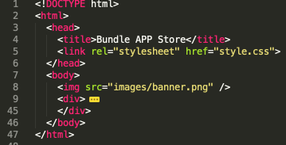
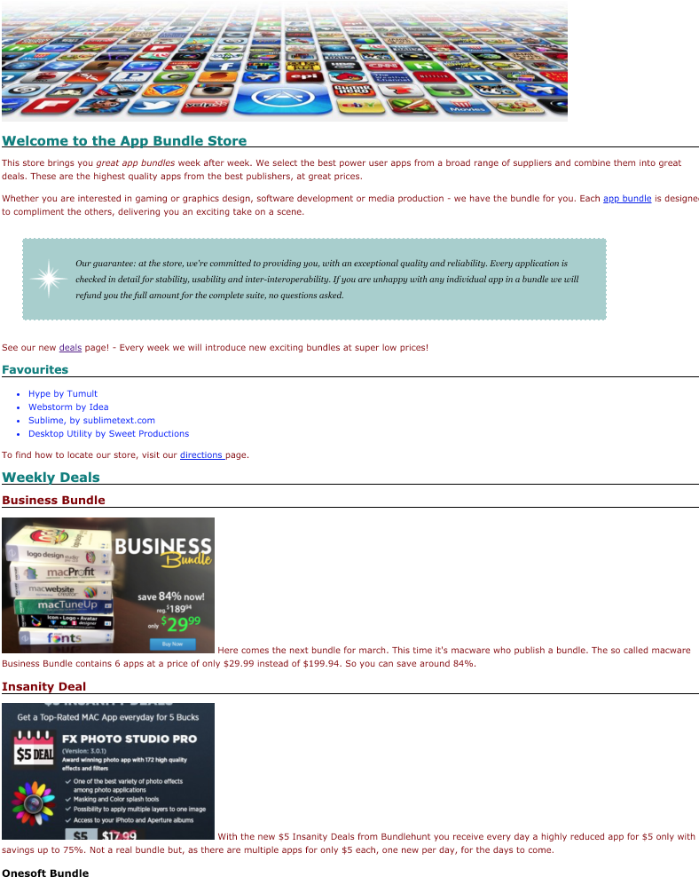

# div

Open the main index page and introduce a new `
` element, wrapping most (but not all) elements in `<body>` (exclude the first `` element):

~~~html
  <body>
    
    

    <h1>Welcome to the App Bundle Store</h1>
    

      This store brings you <em> great app bundles </em> week after week. We
      select the best power user apps from a broad range of suppliers and
      combine them into great deals. These are the highest quality apps from the
      best publishers, at great prices.
    

    

      Whether you are interested in gaming or graphics design, software
      development or media production - we have the bundle for you. Each
      <a href="apps.html">app bundle</a> is designed to compliment the others,
      delivering you an exciting take on a scene.
    

    

      Our guarantee: at the store, we're committed to providing you,
      with an exceptional quality and reliability. Every application is checked in detail
      for stability, usability and inter-interoperability. If you are unhappy with any
      individual app in a bundle we will refund you the full amount for the complete suite,
      no questions asked.
    

    

      See our new <a href="deals/deals.html"> deals</a> page! - Every week we
      will introduce new exciting bundles at super low prices!
    

    <h2>Favourites</h2>
    <ul class="highlight">
      <li>Hype by Tumult</li>
      <li>Webstorm by Idea</li>
      <li>Sublime, by sublimetext.com</li>
      <li>Desktop Utility by Sweet Productions</li>
    </ul>
    

      To find how to locate our store, visit our
      <a href="directions.html"> directions </a> page.
    

    

  </body>
~~~

Notice the indentation - where each element is to move in by 2 spaces consistently, is not followed above: the elements inside `
` should be indented. We can do this easily in sublime as follows.

First, select all the elements inside the div:

The press 'tab' once, it should move the elements in 2 spaces, preserving the indentation of the enclosed elements.

Still in sublime, experiment with the 'folding' behaviour by folding the entire `
` 

This is triggered by hovering the pointer over the left margin until arrows appear, and then using these arrows to alter how the editor displays the html. This, of course, is just a convenience feature - the actual text is not altered. Explore the `Edit->Code Folding` submenu for more options.

Immediately below this section, introduce this new section:

~~~html
    

      <h1>Weekly Deals</h1>
      <h2 class="special">Business Bundle</h2>
      

         Here comes the
        next bundle for march. This time it's macware who publish a bundle. The so
        called macware Business Bundle contains 6 apps at a price of only $29.99
        instead of $199.94. So you can save around 84%.
      

      <h2 class="special">Insanity Deal</h2>
      

         With the new $5
        Insanity Deals from Bundlehunt you receive every day a highly reduced app
        for $5 only with savings up to 75%. Not a real bundle but, as there are
        multiple apps for only $5 each, one new per day, for the days to come.
      

      <h3>Onesoft Bundle</h3>
      

        
        An exciting offerieng from Onesoft. It comes in at
        $199.94. So you can save around 84%. Get it today!
      

    

~~~

This is already wrapped in a `
`.

The page now looks like this:

Finally, give each of these sections an id:

~~~html
    

      ...
    

    

      ...
    

~~~

This is the complete page at this stage:

~~~html
<!DOCTYPE html>
<html>
  <head>
    <title>Bundle APP Store</title>
    <link rel="stylesheet" href="style.css">
  </head>
  <body>
    
    

      <h1>Welcome to the App Bundle Store</h1>
      

        This store brings you <em> great app bundles </em> week after week. We
        select the best power user apps from a broad range of suppliers and
        combine them into great deals. These are the highest quality apps from the
        best publishers, at great prices.
      

      

        Whether you are interested in gaming or graphics design, software
        development or media production - we have the bundle for you. Each
        <a href="apps.html">app bundle</a> is designed to compliment the others,
        delivering you an exciting take on a scene.
      

      

        Our guarantee: at the store, we're committed to providing you,
        with an exceptional quality and reliability. Every application is checked in detail
        for stability, usability and inter-interoperability. If you are unhappy with any
        individual app in a bundle we will refund you the full amount for the complete suite,
        no questions asked.
      

      

        See our new <a href="deals/deals.html"> deals</a> page! - Every week we
        will introduce new exciting bundles at super low prices!
      

      <h2>Favourites</h2>
      <ul class="highlight">
        <li>Hype by Tumult</li>
        <li>Webstorm by Idea</li>
        <li>Sublime, by sublimetext.com</li>
        <li>Desktop Utility by Sweet Productions</li>
      </ul>
      

        To find how to locate our store, visit our
        <a href="directions.html"> directions </a> page.
      

    

    

      <h1>Weekly Deals</h1>
      <h2 class="special">Business Bundle</h2>
      

         Here comes the
        next bundle for march. This time it's macware who publish a bundle. The so
        called macware Business Bundle contains 6 apps at a price of only $29.99
        instead of $199.94. So you can save around 84%.
      

      <h2 class="special">Insanity Deal</h2>
      

         With the new $5
        Insanity Deals from Bundlehunt you receive every day a highly reduced app
        for $5 only with savings up to 75%. Not a real bundle but, as there are
        multiple apps for only $5 each, one new per day, for the days to come.
      

      <h3>Onesoft Bundle</h3>
      

        
        An exciting offerieng from Onesoft. It comes in at
        $199.94. So you can save around 84%. Get it today!
      

    

  </body>
</html>
~~~

