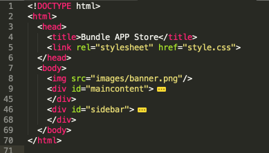
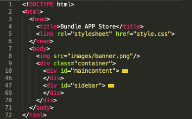

# Grid Container

The Html standards have struggled with multi-column layout over many generations of browser and versions of the W3C standards, with many contrasting approaches emerging over the years.

This has finally yielded a new standard called Grid Layout:

- <https://developer.mozilla.org/en-US/docs/Web/CSS/CSS_Grid_Layout>

We will introduce this now into our page. First, one more adjustment. If we can 'fold' our page in sublime, it might look like this:

Now introduce yet another `
`, this time wrapping both existing divs:

This division has the class name "container". Our body is now structured like this:

~~~html
   
   

     

        ...
     

     

        ...
     

   

~~~

## Grid Styles

Include this new rule in the style sheet:

~~~css
.container {
  display: grid;
  grid-template-columns: 70% 30%;
}
~~~

Refresh the page - it should look like this:

This simple rule has divided the page into 2 columns - and automatically "maincontent" and "sidebar" into these, sized at 70% and 30% of the page.

