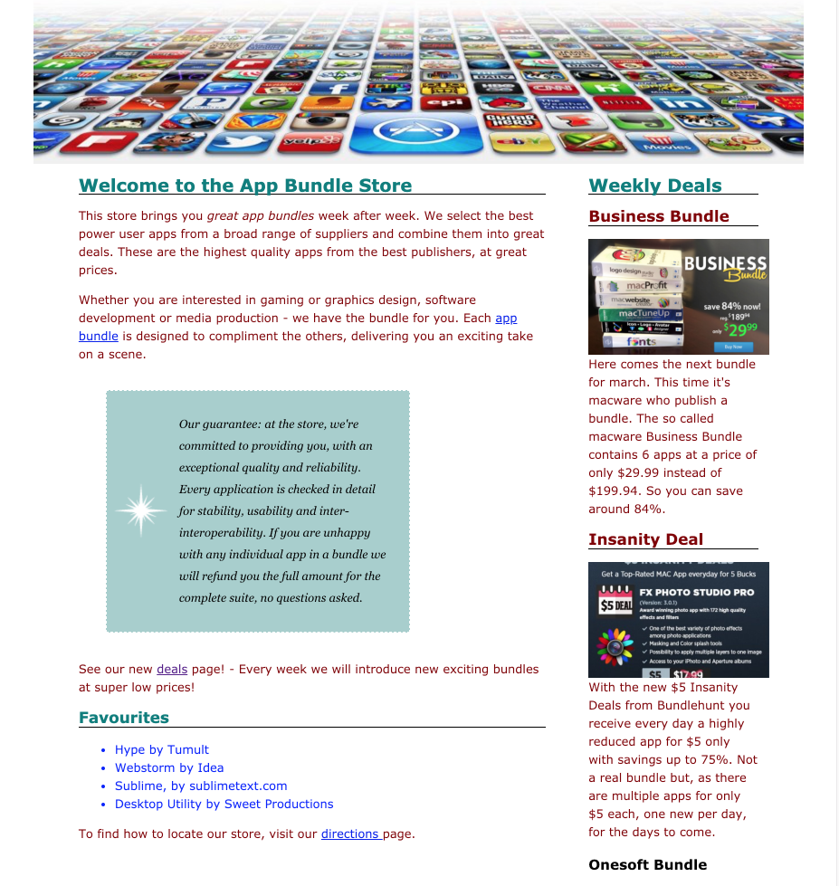

#Exercise

This is the final version of the project at this stage:

- <https://github.com/wit-hdip-comp-sci-2019/bundle-store/releases/tag/lab.03.end>

## Exercise

Have a look at this screen shot here:

Notice two aspects:

- The sidebar images are resized to a uniform dimension
- The banner image is centred

Try to make these changes. Your strategy might be as follows:

- define a rule targeting the side bar images
- define a different rule targeting the banner image

In those rule, apply properties to:

- resize (say the width only) the sidebar images
- center the banner image

Use classes for the selector, marking all sidebar images with one class (say "sidebar-img") and another for the banner ("banner-img").

If you are finding this a bit mysterious - then download and explore the solution project here:

- <https://github.com/wit-hdip-comp-sci-2019/bundle-store/releases/tag/lab.03.exercises>
