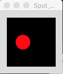
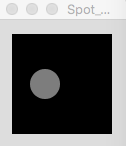
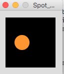

#Adding behaviour (methods) to Spot

We will continue looking at the behaviour (methods) in classes.    

**Note:**  The version of Spot below doesn't enforce the encapsulation rules yet.  We will implement these rules in SpotV7.0 (consistent with how we did it in lectures).  We will bring in Encapsulation in Step04 of this lab when we add the accessors and mutators.

##Spot V5.0 - colour() method

Save your **Spot_Version4_0** as **Spot_Version5_0**.

Add the following fields to the Spot class 

~~~java
  int red, green, blue, gray;
~~~

Type in the following colour() method code to the Spot class:

~~~java
void colour(int redVal, int greenVal, int blueVal)
  {
    red = redVal;
    green = greenVal;
    blue = blueVal;
    fill (red, green, blue);
  }
~~~

and then in the *main* tab, refactor the draw() method to: 

~~~java 
void draw()
{
  background(0);
  sp.colour(255,10,20);
  sp.display();
}
~~~   

Run the code.  

Your output should now look like:

Save your work (don't close the project though).

##Spot V5.1 - Adding a second (overloaded) colour() method

Save your **Spot_Version5_0** work as **Spot_Version5_1**.

Type the following extra method code in your Spot class:

~~~java
 void colour(int grayVal)
  {
    gray = grayVal;
    fill (gray);
  }
~~~ 

Now we want to call this extra method, so you need to change the draw method in the *main* tab:

~~~java
void draw()
{
  background(0);
  sp.colour(125);
  sp.display();
}
~~~

Run the code.  

Your output should now look like:

Can you explain why the output is different from the previous output. 

Save your work (don't close the project though).

##Spot V5.2 - Adding another constructor (to introduce a grayscale starting colour)

Save your **Spot_Version5_1** work as **Spot_Version5_2**.

Type in the following extra method code in your Spot class:

~~~java
 Spot(float xPos, float yPos, float diamtr, int grayVal)
   {
     xCoord = xPos;
     yCoord = yPos;
     diameter = diamtr;
     colour(grayVal);  
   }
~~~

This constructor allows us to define the colour (in grayscale) of the spot when creating the object. 

Now we want to call this extra constructor, so you need to change the code in the setup method in the *main* tab:

~~~java
Spot sp;

void setup()
{
  size (100,100);
  noStroke();
  sp = new Spot(33, 50, 30, 125);
}

void draw()
{
  background(0);
  sp.display();
}
~~~

Your output should now look like:

Can you answer why this is producing the same output as the previous version? 

Save your work (don't close the project though).

##Spot 5.3 - Adding another constructor (to introduce an r,g,b starting colour)

Save your **Spot_Version5_2** work as **Spot_Version5_3**.

Type in the following extra method code in your Spot class:

~~~java
 Spot(float xPos, float yPos, float diamtr, int redVal, int greenVal, int blueVal)
   {
     xCoord = xPos;
     yCoord = yPos;
     diameter = diamtr;
     colour(redVal, greenVal, blueVal);  
   }
~~~

Then refactor your setup method in the *main* tab like so:

~~~java
void setup()
{
  size (100,100);
  noStroke();
  sp = new Spot(33, 50, 30, 255,150,50);
}
~~~

Run the code.  

You should see the a differently coloured spot. 

Change the rgb values in the constructor and see how this changes the colour in the spot. 

Also use the colour method in the draw() method to change the colour. Will this work? Is this the best use of the constructor?

Note that now, your Spot class should look like: 

~~~java
class Spot{
  float xCoord, yCoord;
  float diameter;
  int red, green, blue, gray;
  
  Spot()
  {
  }
  
  Spot(float xPos, float yPos, float diamtr)
  {
     xCoord = xPos;
     yCoord = yPos;
     diameter = diamtr;
   }
  
   Spot(float xPos, float yPos, float diamtr, int grayVal)
   {
     xCoord = xPos;
     yCoord = yPos;
     diameter = diamtr;
     colour(grayVal);
   }

   Spot(float xPos, float yPos, float diamtr, int redVal, int greenVal, int blueVal)
   {
     xCoord = xPos;
     yCoord = yPos;
     diameter = diamtr;
     colour(redVal, greenVal, blueVal);  
   }
   
   void display()
   {
     ellipse(xCoord, yCoord, diameter, diameter);
   } 
  
   void colour(int redVal, int greenVal, int blueVal)
   {
     red = redVal;
     green = greenVal;
     blue = blueVal;
     fill (red, green, blue);
   }

   void colour(int grayVal)
   {
     gray = grayVal;
     fill (gray);
   }
}
~~~

Save your work (don't close the project though).

