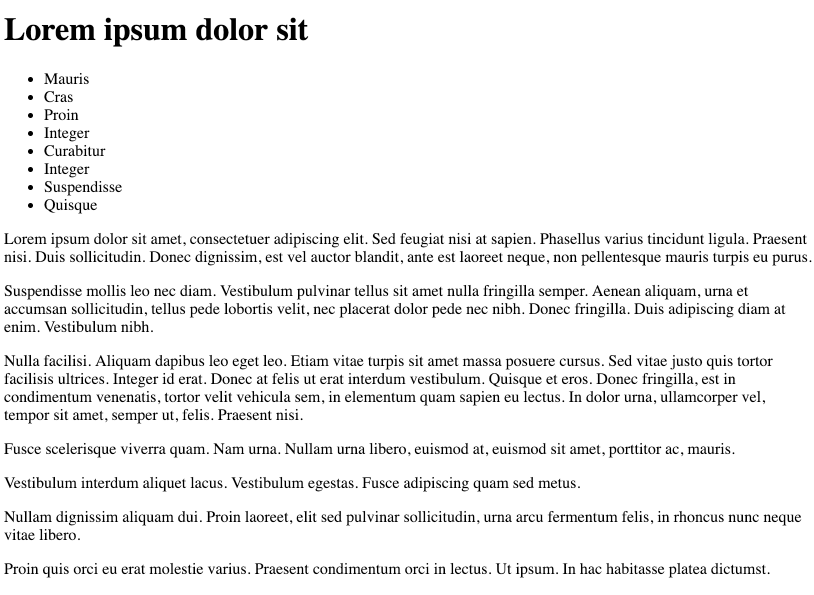

#Setup

In Sublime create a new lab-03b folder in your work area. This time we will not be using any content from the previous lab.

In this project create this file:

## home.html

~~~html
<!DOCTYPE html>
<html>
  <head>
    <title>Home Page</title>
  </head>
  <body>
    <h1>
      Lorem ipsum dolor sit
    </h1>
    <ul>
      <li>Mauris</li>
      <li>Cras</li>
      <li>Proin</li>
      <li>Integer</li>
      <li>Curabitur</li>
      <li>Integer</li>
      <li>Suspendisse</li>
      <li>Quisque</li>
    </ul>
    

      Lorem ipsum dolor sit amet, consectetuer adipiscing elit. Sed feugiat nisi
      at sapien. Phasellus varius tincidunt ligula. Praesent nisi. Duis
      sollicitudin. Donec dignissim, est vel auctor blandit, ante est laoreet
      neque, non pellentesque mauris turpis eu purus.
    

    

      Suspendisse mollis leo nec diam. Vestibulum pulvinar tellus sit amet nulla
      fringilla semper. Aenean aliquam, urna et accumsan sollicitudin, tellus
      pede lobortis velit, nec placerat dolor pede nec nibh. Donec fringilla. Duis
      adipiscing diam at enim. Vestibulum nibh.
    

    

      Nulla facilisi. Aliquam dapibus leo eget leo. Etiam vitae turpis sit amet
      massa posuere cursus. Sed vitae justo quis tortor facilisis ultrices.
      Integer id erat. Donec at felis ut erat interdum vestibulum. Quisque et eros.
      Donec fringilla, est in condimentum venenatis, tortor velit vehicula sem, in
      elementum quam sapien eu lectus. In dolor urna, ullamcorper vel, tempor sit
      amet, semper ut, felis. Praesent nisi.
    

    

      Fusce scelerisque viverra quam. Nam urna. Nullam urna libero, euismod at,
      euismod sit amet, porttitor ac, mauris.
    

    

      Vestibulum interdum aliquet lacus. Vestibulum egestas. Fusce adipiscing
      quam sed metus.
    

    

      Nullam dignissim aliquam dui. Proin laoreet, elit sed pulvinar
      sollicitudin, urna arcu fermentum felis, in rhoncus nunc neque vitae
      libero.
    

    

      Proin quis orci eu erat molestie varius. Praesent condimentum
      orci in lectus. Ut ipsum. In hac habitasse platea dictumst.
    

  </body>
</html>
~~~

Reloading in the browser, it should look like this:

