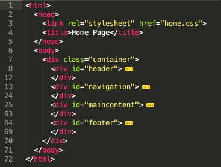

#Div

We are now going to divide our content into a series of sections:

- header
- maincontent
- navigation
- footer

..using `
`s.

First the "header":

~~~html
    
  
      <h1>
        Lorem ipsum dolor sit
      </h1>  
    

~~~

Be sure to preserve the indentation as shown

Then "navigation":

~~~html
    
  
      <ul>  
        <li>Mauris</li>  
        <li>Cras</li>  
        <li>Proin</li>  
        <li>Integer</li>  
        <li>Curabitur</li>  
        <li>Integer</li>  
        <li>Suspendisse</li>  
        <li>Quisque</li>  
      </ul>  
    

~~~

Next "maincontent"

~~~html
    

      

        Lorem ipsum dolor sit amet, consectetuer adipiscing elit. Sed feugiat nisi  
        at sapien. Phasellus varius tincidunt ligula. Praesent nisi. Duis  
        sollicitudin. Donec dignissim, est vel auctor blandit, ante est laoreet  
        neque, non pellentesque mauris turpis eu purus.
      
  
      

        Suspendisse mollis leo nec diam. Vestibulum pulvinar tellus sit amet nulla  
        fringilla semper. Aenean aliquam, urna et accumsan sollicitudin, tellus  
        pede lobortis velit, nec placerat dolor pede nec nibh. Donec fringilla. Duis  
        adipiscing diam at enim. Vestibulum nibh.
      
  
      

        Nulla facilisi. Aliquam dapibus leo eget leo. Etiam vitae turpis sit amet  
        massa posuere cursus. Sed vitae justo quis tortor facilisis ultrices.  
        Integer id erat. Donec at felis ut erat interdum vestibulum. Quisque et eros.  
        Donec fringilla, est in condimentum venenatis, tortor velit vehicula sem, in  
        elementum quam sapien eu lectus. In dolor urna, ullamcorper vel, tempor sit  
        amet, semper ut, felis. Praesent nisi.
      
  
      

        Fusce scelerisque viverra quam. Nam urna. Nullam urna libero, euismod at,  
        euismod sit amet, porttitor ac, mauris.
      
  
      

        Vestibulum interdum aliquet lacus. Vestibulum egestas. Fusce adipiscing  
        quam sed metus.
      
  
      

        Nullam dignissim aliquam dui. Proin laoreet, elit sed pulvinar  
        sollicitudin, urna arcu fermentum felis, in rhoncus nunc neque vitae  
        libero.
      

    

~~~

and finally "footer":

~~~html
    

      

        Proin quis orci eu erat molestie varius. Praesent condimentum  
        orci in lectus. Ut ipsum. In hac habitasse platea dictumst.
      

    

~~~

Again, be careful to preserve the indentation. Verify that the home pages appearance has not changed. Finally, experiment with the folding nature of the sublime editor.

For instance, try collapsing everything in the page. This can be done by pressing all of the arrow signs in the left hand margin. 

You may be able to generate a view something like this:

This is the complete page now:

~~~html
<html>
  <head>
    <title>Home Page</title>
  </head>
  <body>
    

      

        <h1>
          Lorem ipsum dolor sit
        </h1>
      

      

        <ul>
          <li>Mauris</li>
          <li>Cras</li>
          <li>Proin</li>
          <li>Integer</li>
          <li>Curabitur</li>
          <li>Integer</li>
          <li>Suspendisse</li>
          <li>Quisque</li>
        </ul>
      

      

        

          

            Lorem ipsum dolor sit amet, consectetuer adipiscing elit. Sed feugiat nisi
            at sapien. Phasellus varius tincidunt ligula. Praesent nisi. Duis
            sollicitudin. Donec dignissim, est vel auctor blandit, ante est laoreet
            neque, non pellentesque mauris turpis eu purus.
          

          

            Suspendisse mollis leo nec diam. Vestibulum pulvinar tellus sit amet nulla
            fringilla semper. Aenean aliquam, urna et accumsan sollicitudin, tellus
            pede lobortis velit, nec placerat dolor pede nec nibh. Donec fringilla. Duis
            adipiscing diam at enim. Vestibulum nibh.
          

          

            Nulla facilisi. Aliquam dapibus leo eget leo. Etiam vitae turpis sit amet
            massa posuere cursus. Sed vitae justo quis tortor facilisis ultrices.
            Integer id erat. Donec at felis ut erat interdum vestibulum. Quisque et eros.
            Donec fringilla, est in condimentum venenatis, tortor velit vehicula sem, in
            elementum quam sapien eu lectus. In dolor urna, ullamcorper vel, tempor sit
            amet, semper ut, felis. Praesent nisi.
          

        

        

          

            Fusce scelerisque viverra quam. Nam urna. Nullam urna libero, euismod at,
            euismod sit amet, porttitor ac, mauris.
          

          

            Vestibulum interdum aliquet lacus. Vestibulum egestas. Fusce adipiscing
            quam sed metus.
          

          

            Nullam dignissim aliquam dui. Proin laoreet, elit sed pulvinar
            sollicitudin, urna arcu fermentum felis, in rhoncus nunc neque vitae
            libero.
          

        

      

      

        

          Proin quis orci eu erat molestie varius. Praesent condimentum
          orci in lectus. Ut ipsum. In hac habitasse platea dictumst.
        

      

    

  </body>
</html>
~~~

