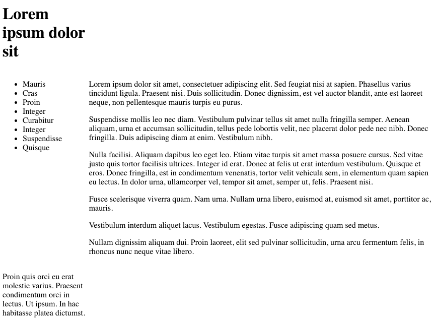

# Grid Container

Create a new file:

- home.css

Insert the following into the `<head>` element of the home.html to tie in the style sheet:

~~~html
    <link rel="stylesheet" href="home.css">
~~~

Now lets try the following rules:

~~~css
body
.container {
  display: grid;
  grid-template-columns: 25% 25% 25% 25%
}

#header {
}

#navigation {
}

#maincontent {
}

#footer {
}
~~~

Save, and refresh. The home page should now look like this:

This is a four column layout - each equal width.