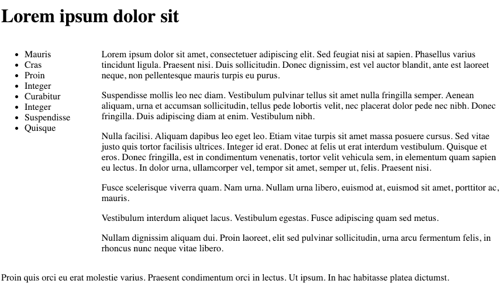

# Grid Items

Revise the rules as follows into a 2 columns configuration:

~~~css
.container {
  display: grid;
  grid-template-columns: 20% 80%;
}
~~~~

... and then position each of our sections in this structure:

~~~
#header {
  grid-column-start: 1;
}

#navigation {
  grid-column-start: 1;
}

#maincontent {
  grid-column-start: 2;
}

#footer {
  grid-column-start: 1;
}
~~~

This should look like this:

We might like our header and footer sections to span the full width. Try this version of those rules:

~~~
#header {
  grid-column-start: 1;
  grid-column-end : span 2;
}

#footer {
  grid-column-start: 1;
  grid-column-end : span 2;
}
~~~

Notice we are using 1 column beyond the end (3 instead of 2).

This has stretched the header and footer to the full page width.