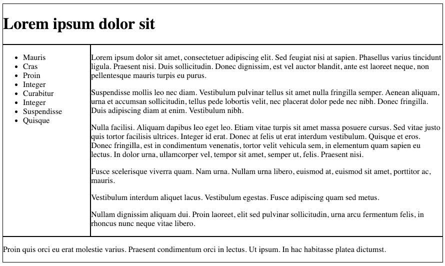
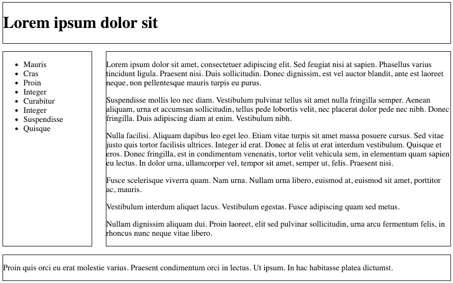
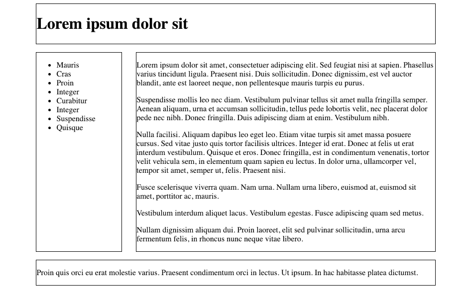

# Grid lines

Introduce the following property for each of the grid item rules in the style sheet:

~~~
  border : solid 1px;
~~~

i.e. for #header, #navigation, #maincontent and #footer

Reload the page:

This is presenting us with grid lines - enabling is to see interaction of the box model and the grid system.

With these lines in place, we might be able to experiment with grid-gap widths:

~~~css
.container {
  display: grid;
  grid-template-columns: 20% 77%;
  grid-gap: 3%;
}
~~~

We can see the 3% gap in action here. Notice that we are careful to keep the total percentages (including the single gap) to 100%. i.e. 20 + 77 + 3 = 100.

We can further experiment with the column structure :

~~~
.container {
  display: grid;
  grid-template-columns: 5% 18% 63% 5%;
  grid-gap: 3%;
}

#header {
  grid-column-start: 2;
  grid-column-end : span 2;
  border : solid 1px;

}

#navigation {
  grid-column-start: 2;
  border : solid 1px;
}

#maincontent {
  grid-column-start: 3;
  border : solid 1px;
}

#footer {
  grid-column-start: 2;
  grid-column-end : span 2;
  border : solid 1px;
}
~~~

Look carefully at the grid container dimensions:

~~~
  grid-template-columns: 5% 18% 63% 5%;
  grid-gap: 3%;
~~~

... and then the start and span columns for each of the sections. The page now renders like this:

Again, place close attention to the dimension calculations:

- 5 + 18 + 63 + 5 + 3 x 3 = 100

These dimensions are giving our content a proportional margin at either side of the content.
