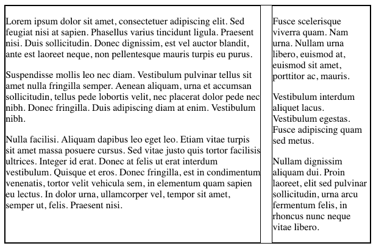
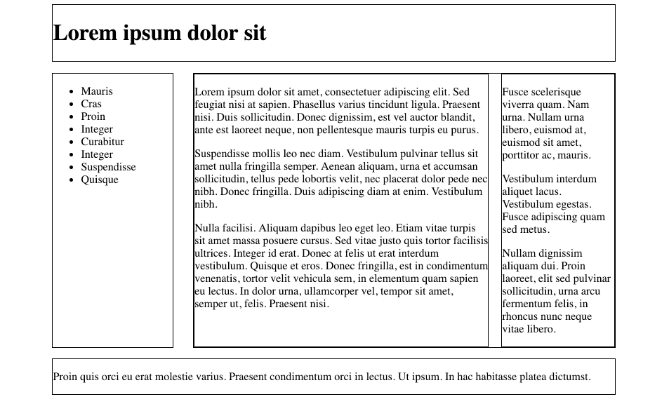

#Nested Grid

Notice that our #maincontent section is divided into primary and secondary sections:

~~~html
     

        

          

            Lorem ipsum dolor sit amet, consectetuer adipiscing elit. Sed feugiat nisi
            at sapien. Phasellus varius tincidunt ligula. Praesent nisi. Duis
            sollicitudin. Donec dignissim, est vel auctor blandit, ante est laoreet
            neque, non pellentesque mauris turpis eu purus.
          

          

            Suspendisse mollis leo nec diam. Vestibulum pulvinar tellus sit amet nulla
            fringilla semper. Aenean aliquam, urna et accumsan sollicitudin, tellus
            pede lobortis velit, nec placerat dolor pede nec nibh. Donec fringilla. Duis
            adipiscing diam at enim. Vestibulum nibh.
          

          

            Nulla facilisi. Aliquam dapibus leo eget leo. Etiam vitae turpis sit amet
            massa posuere cursus. Sed vitae justo quis tortor facilisis ultrices.
            Integer id erat. Donec at felis ut erat interdum vestibulum. Quisque et eros.
            Donec fringilla, est in condimentum venenatis, tortor velit vehicula sem, in
            elementum quam sapien eu lectus. In dolor urna, ullamcorper vel, tempor sit
            amet, semper ut, felis. Praesent nisi.
          

        

        

          

            Fusce scelerisque viverra quam. Nam urna. Nullam urna libero, euismod at,
            euismod sit amet, porttitor ac, mauris.
          

          

            Vestibulum interdum aliquet lacus. Vestibulum egestas. Fusce adipiscing
            quam sed metus.
          

          

            Nullam dignissim aliquam dui. Proin laoreet, elit sed pulvinar
            sollicitudin, urna arcu fermentum felis, in rhoncus nunc neque vitae
            libero.
          

        

      

~~~

We would like to make this specific section 2 column, so that it looks like this:

The first step would be to redefine the #maincontent elements as both a grid item and a grid container:

~~~css
#maincontent {
  grid-column-start: 3;
  border : solid 1px;
  display: grid;
  grid-template-columns: 70% 27%;
  grid-gap: 3%;
}
~~~

The extra two properties set the scene for its grid items:

~~~css
#primary {
  grid-column-start: 1;
  border : solid 1px;
}

#secondary {
  grid-column-start: 2;
  border : solid 1px;
}
~~~

This should now look like this:

This is the complete style sheet at this stage:

~~~css
.container {
  display: grid;
  grid-template-columns: 5% 18% 63% 5%;
  grid-gap: 3%;
}

#header {
  grid-column-start: 2;
  grid-column-end : span 2;
  border : solid 1px;
}

#navigation {
  grid-column-start: 2;
  border : solid 1px;
}

#maincontent {
  grid-column-start: 3;
  border : solid 1px;
  display: grid;
  grid-template-columns: 70% 27%;
  grid-gap: 3%;
}

#primary {
  grid-column-start: 1;
  border : solid 1px;
}

#secondary {
  grid-column-start: 2;
  border : solid 1px;
}

#footer {
  grid-column-start: 2;
  grid-column-end : span 2;
  border : solid 1px;
}
~~~

We might remove all grid lines now that our layout is complete:

~~~css
.container {
  display: grid;
  grid-template-columns: 5% 18% 63% 5%;
  grid-gap: 3%;
}

#header {
  grid-column-start: 2;
  grid-column-end : span 2;
}

#navigation {
  grid-column-start: 2;
}

#maincontent {
  grid-column-start: 3;
  display: grid;
  grid-template-columns: 70% 27%;
  grid-gap: 3%;
}

#primary {
  grid-column-start: 1;
}

#secondary {
  grid-column-start: 2;
}

#footer {
  grid-column-start: 2;
  grid-column-end : span 2;;
}
~~~

