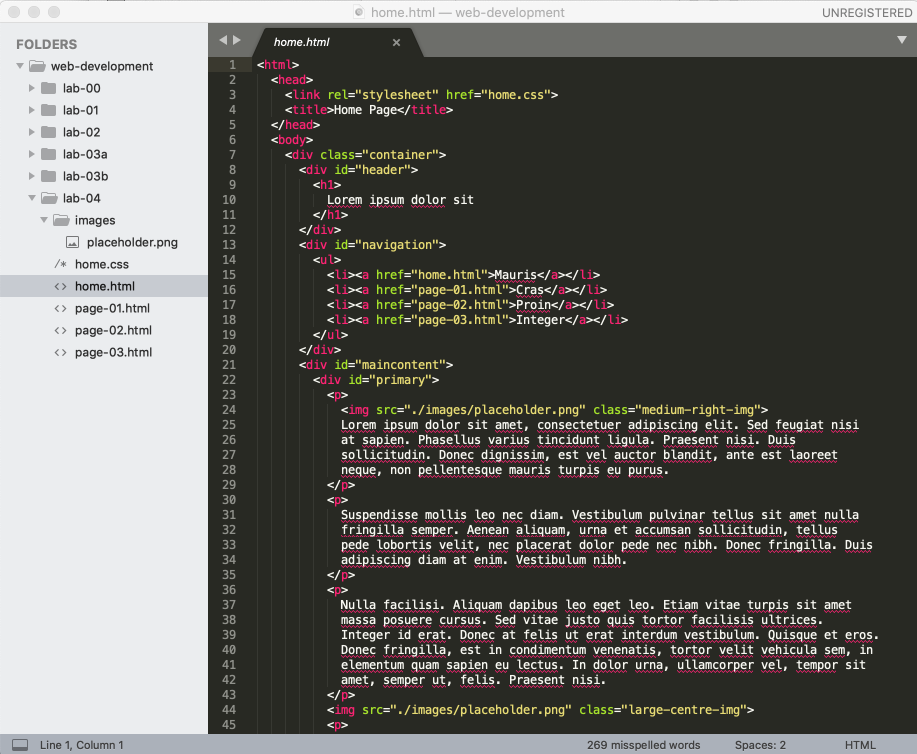

# Setup

This is a completed version of last weeks lab, including exercises, which extended the project to include several interlinked pages:

- <https://github.com/wit-hdip-comp-sci-2020/grid-layout/releases/tag/lab.3b.exercises>

Download, unzip this project and expand it into your web-development folder. Make sure the project folder is called `lab04`. Your Sublime workspace should look like this:

Review the site by opening the home page - it should be the same as this:

- [Layout Site](https://wit-hdip-comp-sci-2019.github.io/grid-layout-v1/home.html)

