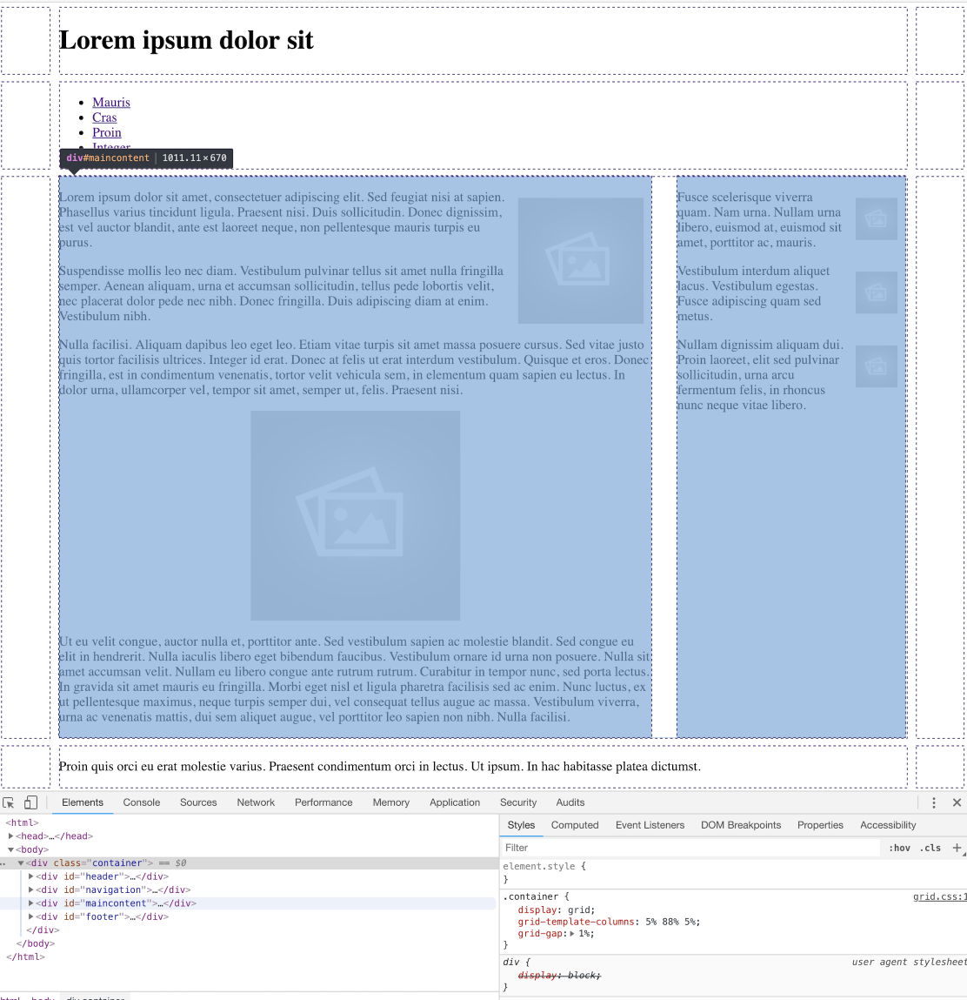

# Restructure Grid

We will restructure the page layout to a 3 column structure, with a reduced grid gap:

## home.css

~~~
.container {
  display: grid;
  grid-template-columns: 5% 88% 5%;
  grid-gap: 1%;
}
~~~

This will completely disrupt the layout (try it), until we revise the column start positions:

Change the navigation to span 2 columns:

~~~
#navigation {
  grid-column-start: 2;
  grid-column-end: span 2;
}
~~~

Also adjust `maincontent` start column:

~~~
#maincontent {
  grid-column-start: 2;
  ...
}
~~~

Finally, we can simplify the `footer` rule:

~~~
#footer {
  grid-column-start: 2;
}
~~~

You should be able to view the page with the aid of the developer tools:

This is revealing the grid structure.