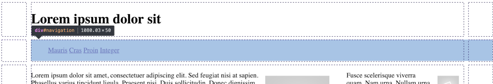
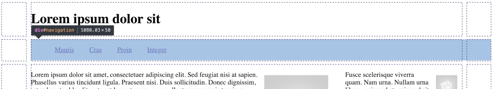

# Navigation Menu

All our pages have the following `navigation` section:

~~~
      

        <ul>
          <li><a href="home.html">Mauris</a></li>
          <li><a href="page-01.html">Cras</a></li>
          <li><a href="page-02.html">Proin</a></li>
          <li><a href="page-03.html">Integer</a></li>
        </ul>
      

~~~

In all of the pages, change this specific element:

~~~
        <ul>
~~~

to 

~~~
        <ul id="menu">
~~~

So that each navigation section looks like this:

~~~
      

        <ul id="menu">
          <li><a href="home.html">Mauris</a></li>
          <li><a href="page-01.html">Cras</a></li>
          <li><a href="page-02.html">Proin</a></li>
          <li><a href="page-03.html">Integer</a></li>
        </ul>
      

~~~

Create a new style sheet called `nav.css`, and include this rule:

~~~
ul#menu li {
  display: inline;
}
~~~

Because of the changes we have just made, we can target the `<li>`, making it `inline` instead of the the default `<block>` style.

Include nav.css in home.css:

## home.css

~~~
@import url("grid.css");
@import url("image.css");
@import url("nav.css");
~~~

Examine the header now in a browser - it should look like this:

The header items are displayed on a single line.

We can further adjust the spacing between each of the `<li>` elements:

~~~
ul#menu li {
  display: inline;
  padding-right: 1em;
  padding-left: 1em;
}
~~~

