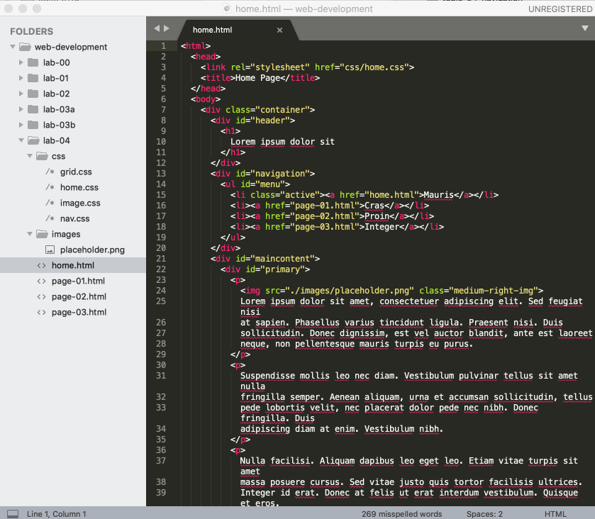

# Style folder

Finally, we can reorganise the project structure to keep all style sheets together in one folder for convenience and coherence. In the project, create a directory to hold all the stylesheets called 'css'. The move all the style sheets into this folder:

You will also need to change the `<link>` header element in each page to import the stylesheet from the css folder:

~~~
    <link rel="stylesheet" href="css/home.css">
~~~

Verify now that the site continues to work as expected.