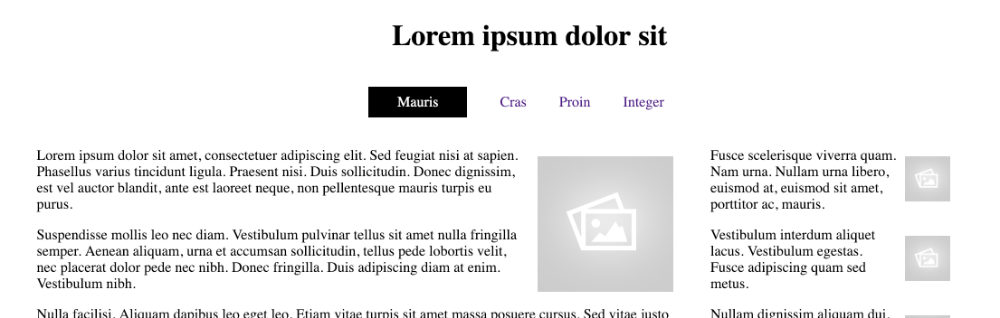

# Solution

This is the project as completed in this lab:

- <https://github.com/wit-hdip-comp-sci-2020/grid-layout/releases/tag/lab.04.end>

# Exercises

## Exercise 1: Centre Header and Navigation

Making changes just to nav.css, center align the header and navigation sections:

This is the property that can achieve this effect:

~~~
  text-align: center;
~~~

## Exercises 2: Additional page

Create one additional page in the site, and tie it into the style and navigation structure already defined.
