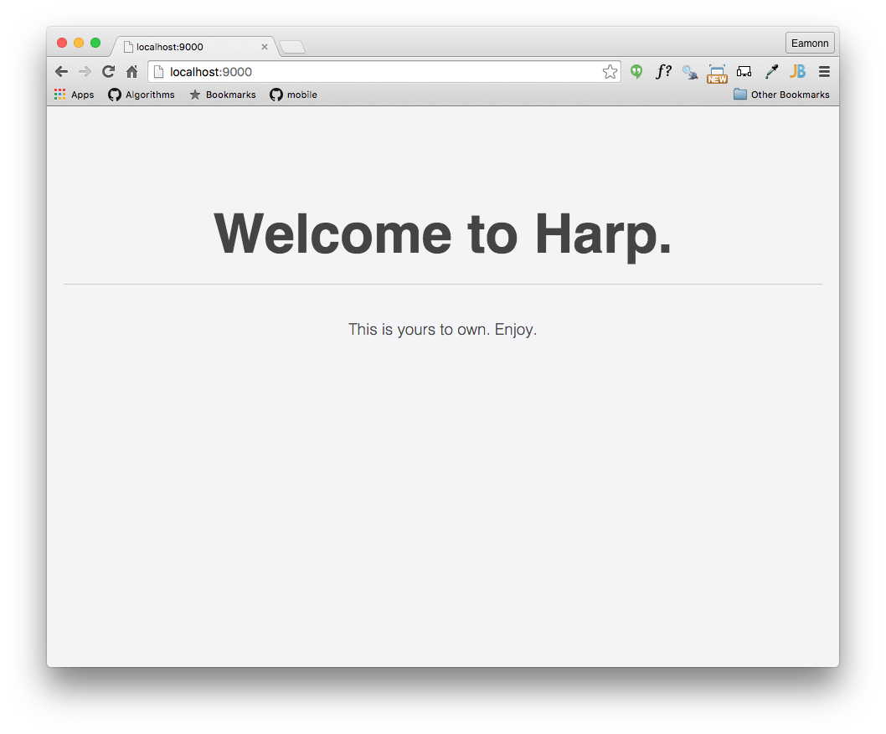

# Using Harp

Create a new folder for your project in your `web-development` folder called `lab-05a`. Then change into this folder using the `cd` command.

Before entering the next few commands, make sure you know EXACTLY where your command prompt session is located in the folder structure. Perhaps you may be somewhere like:

- `C:\dev\web-development\lab-05a`

See the previous step for guidance on this. If you are confused as to which folder tour command prompt is based in, just enter this command:

~~~
dir
~~~

This will list the `current` directory contents.

## Using Harp

If harp was successfully installed, from the command prompt try this command (make sure you are in the lab-05a folder) :

~~~
harp init demo
~~~

This will respond with: 

~~~
Downloading boilerplate: https://github.com/harp-boilerplates/default
Initialized project at /Users/edeleastar/repos/wit-hdip-comp-sci/web-development/lab05a/demo
~~~

Back in the command prompt (again, make sure you are in lab-05a directory),  enter:

~~~
cd demo
harp server
~~~

On windows, you may get a dialog indicating from your firewall asking for permission to run this application. Select 'Allow Access'

You should see this on the command prompt: 

~~~
Harp v0.31.0 – Chloi Inc. 2012–2015
Your server is listening at http://localhost:9000/
Press Ctl+C to stop the server
------------
~~~

Here is a screenshot of the last few commands:

Now browse to this url here:

- <http://localhost:9000>

and you should see this page:

To stop 'serving' the page, enter Ctrl-C in the command prompt:

~~~
Harp v0.25.0 – Chloi Inc. 2012–2015
Your server is listening at http://localhost:9000/
Press Ctl+C to stop the server
------------
^C
 
~~~

