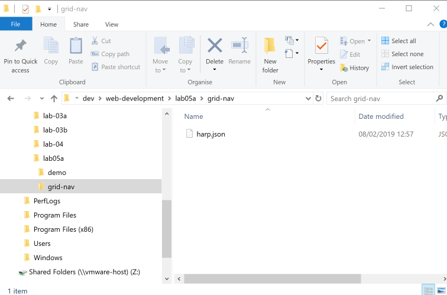

# Project Setup

Make sure your command prompt is running `C:\dev\web-development\lab-05a>` folder (or whatever is the correct folder on your workstation). If you are following on form the last step, then you may wish to enter:

~~~
cd ..
~~~ 

first. Alternatively, you can enter:

~~~
cd /
cd dev
cd web-development
cd lab-05a
~~~

to get there explicitly.

Create a new project from the command prompt now by entering the following command:

~~~
C:\dev\web-development\lab0-5a>harp init grid-nav
~~~

Opening the folder should reveal these files:

A new folder called `grid-nav` has been created. We will use files like the one generated later - but for the moment delete all of these files and replace them with the following file called `harp.json`:

## harp.json

~~~
{
  "globals": 
  {

  }
}
~~~

You will need to use Sublime to create this file (copy/paste the above) - and then save it into the new project folder.

Now get the solution to last weeks lab:

- <https://github.com/wit-hdip-comp-sci-2019/grid-layout/releases/tag/lab.04.exercises>

Unzip the project, and place its contents into a folder called `public` that you create in the lab-05a folder:

Look carefully at the above, your project should be exactly as shown. I.e. all the project files + folders are in a `public` folder inside the `grid-nav` folder in the `lab-05a` folder. If the structure does not match this, then the next steps will not work correctly.  

Make sure it is configured like this before going on to the next step.