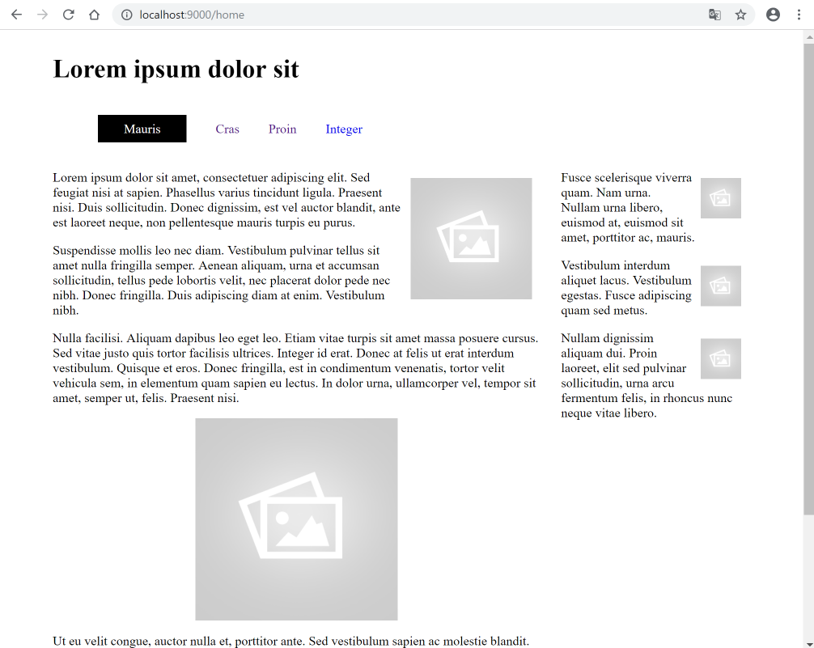

# Deployment

Now we will `serve` the web site locally with this command:

~~~
harp server
~~~

This will look like this:

~~~
C:\dev\web-development\lab0-5a\grid-nav>harp server
Your server is listening at http://localhost:9000/
Press Ctl+C to stop the server
~~~

Notice, again, that the command is executed from within the `lab-05a/grid-nav` directory.

Verify that the site is available here:

- <http://localhost:9000/home>

It should look like this:

Terminate the server again with ^C:

~~~
Your server is listening at http://localhost:9000/
Press Ctl+C to stop the server
Terminate batch job (Y/N)? y
^C
C:\dev\web-development\lab0-5a\grid-nav>
~~~

We are about to try out the 'surge' service - have a quick look at the 2 minute video here to set the scene:

- <https://surge.sh/help/getting-started-with-surge>

From still within the `lab0-5a/grid-nav folder`, enter the following 2 command:

~~~
harp compile
surge ./www
~~~

On windows, this may look like this:

~~~
C:\dev\web-development\lab0-5a\grid-nav>harp compile
C:\dev\web-development\lab0-5a\grid-nav>surge ./www
    Welcome to Surge!
    Please login or create an account by entering your email and password:
~~~

You are now about to create a new account with the surge.sh web service.

Enter credential to create a new account now (press return after each entry) - be sure to remember the password. Surge will then deploy the site to a public server:

~~~
  project path: C:\dev\web-development\lab0-5a\grid-nav>
               size: 34 files, 2.3 MB
             domain: dull-pet.surge.sh
             upload: [====================] 100%, eta: 0.0s
   propagate on CDN: [====================] 100%
               plan: Free
              users: youremail@domain.com
         IP address: 192.241.214.148

    Success! Project is published and running at dull-pet.surge.sh
~~~

The `domain` can be customised - in the above example 'dull-pet' was generated, you can replace this with something more suitable (but unique, so perhaps include your initials, the current date or something that may not be used by someone else).

Open a browser to inspect the running site. It might be something like:

- <https://dull-pet.surge.sh/home>

(change dull-pet to the domain generated by your command)

This is now deployed and accessible globally! Make sure the navigation works as expected.
