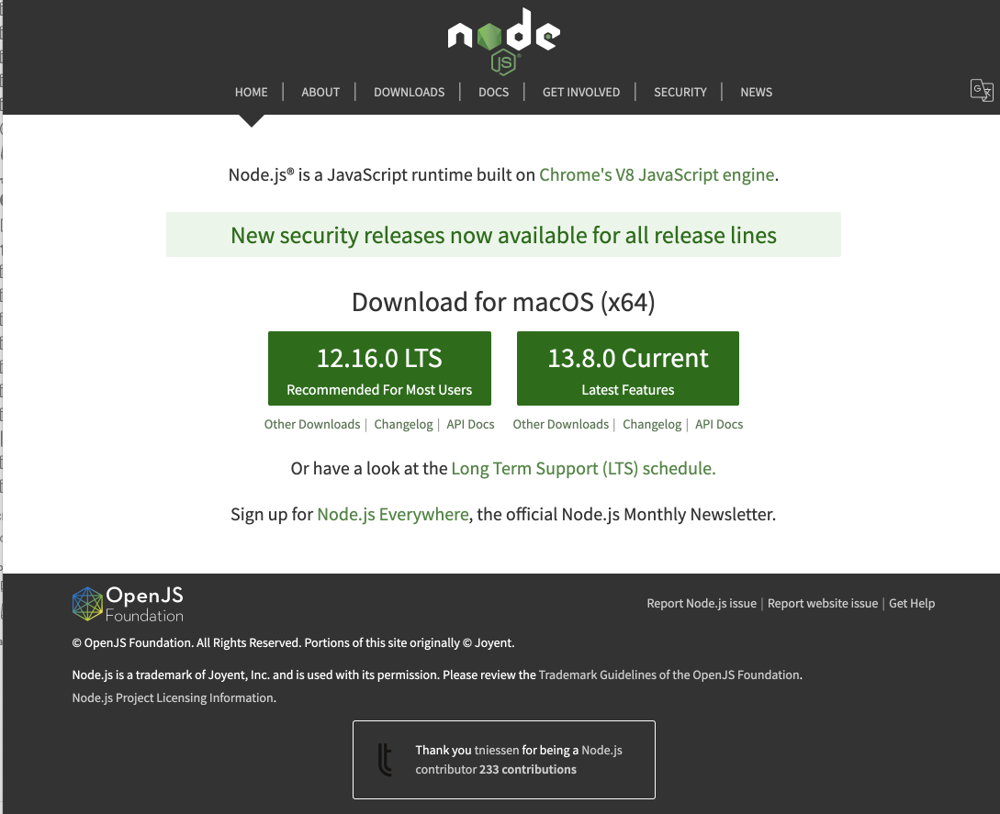
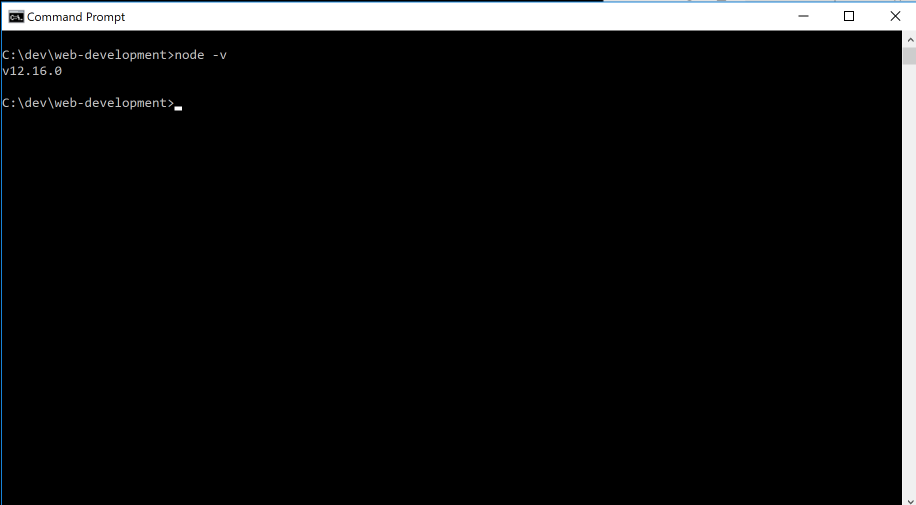
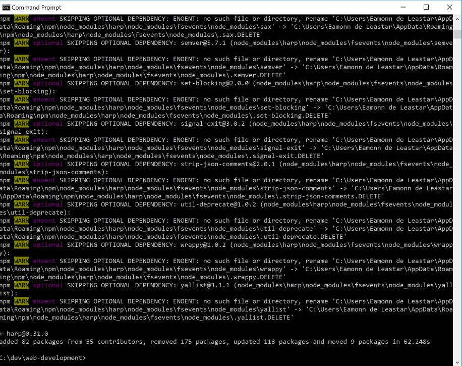

# Installing Git, Node.js, Harp.js and Surge

## Install Git

Although we will not be using it directly for the moment, download and install Git:

- <https://git-scm.com/>

You can accept all defaults during the install.

## Installing Node

We will now install a set of tools to enable us to work with templates in html.

First, install an application called node.js on your workstation:

- <https://nodejs.org/en/>

Download, select and install the `LTS` version (on the left) for your platform. Accept all defaults during the installation. 

If the installation was successful, then you will have a new command called `node` installed on your system. You can test it by entering this on a command prompt:

~~~
node -v
~~~

The response should be a version number:

## Install Harp

If node is installed, then we can install some additional tools. Visit this site:

- <http://harpjs.com/>

Install the application harp.js application. The procedure should be relatively straightforward, just enter the this command at the prompt:

~~~bash
npm install -g harp
~~~

This is the same for Mac or Windows.

This will take a few minutes of log messages, the installation should conclude:

To check if it installed successfully:

~~~
harp -V
~~~

(Note: capital 'V'). It should respond with a version number:

~~~
0.31.0
~~~

# Install Surge

With node and harp installed - you will also need to install:

 - <https://surge.sh/>

The simplest way to do this is to open a terminal and enter:

~~~
npm install surge -g
~~~

After a minute or less it should complete. If successful, try this:

~~~
surge -V
~~~

We should get:

~~~
v0.21.3
~~~

We now have 2 key commands installed in our workstations:

- harp
- surge

We will use both of these in the reaming steps.
