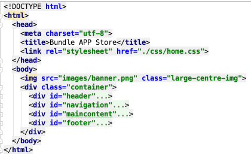

# Setup

This is an extended version of the Bundle Store site from lab 03:

- <https://wit-hdip-comp-sci-2019.github.io/bundle-store/index.html>

Explore the site for few moments. 

The site incorporates the navigation mechanism we devised in Lab 04. Here is th full source:

- <https://github.com/wit-hdip-comp-sci-2019/bundle-store/releases/tag/lab.05.end>

Download, unzip and have a close look at the sources.

This is how the project is structured:

~~~
├──apps.html
├──css
│  ├──grid.css
│  ├──home.css
│  ├──image.css
│  └──nav.css
├──directions.html
├──images
│  ├──background.gif
│  ├──banner.png
│  ├──business.png
│  ├──insanity.jpg
│  ├──ondesoft.jpg
│  └──ultimate.jpeg
└──index.html
~~~

Have a close look at each of the style sheets first. They embody all of the css techniques we have covered to date.

Inspect each of the html files - become familiar with how each page is now structured. In particular, note the divisions:

This structure is laid out via the grid style sheet:

## grid.css

~~~
.container {
  display: grid;
  grid-template-columns: 5% 88% 5%;
  grid-gap: 1%;
}

#header {
  grid-column-start: 2;
  grid-column-end: span 2;
  text-align: center;
}

#navigation {
  grid-column-start: 2;
  text-align: center;
  border-bottom: 1px solid black;
}

#maincontent {
  grid-column-start: 2;
  display: grid;
  grid-template-columns: 70% 27%;
  grid-gap: 3%;
}

#primary {
  grid-column-start: 1;
}

#secondary {
  grid-column-start: 2;
}

#footer {
  grid-column-start: 2;
}
~~~

The navigation mechanism:

is adapted from the previous navigation lab:

## nav.css

~~~
ul#menu li {
  display: inline;
  padding-right: 1em;
  padding-left: 1em;
}

ul#menu a {
  text-decoration: none;
}

#menu li.active a {
  background: #007e7e;
  padding: .5em 2em .5em 2em;
  color: white;
}
~~~

