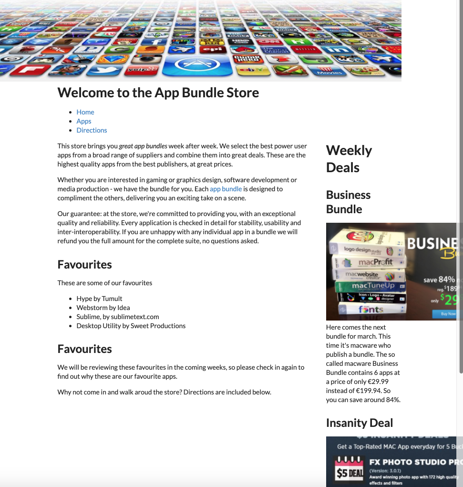

# Grid

We have carefully used the new grid CSS standard in our project, but have now removed it to use Semantic UI. This framework has its own grid system:

- <https://fomantic-ui.com/collections/grid.html>

This is somewhat simpler to master, and has a number of features our implementation did not address.

Here is how we might revise `index.html` (not showing the contents of the article and the aside):

## index.ejs

~~~html
<%- include('./partials/_nav.ejs', {id : "home"}); %>
<main>
  

    

      <article>
      ...
      </article>
    

    

      ...
    

  

</main>
~~~

We are using the 16 grid system defined by Semantic-UI - and defining a 12 - 4 ratio between our main article and the included aside.

This is the complete page:

## index.ejs

~~~html
<%- include('./partials/_nav.ejs', {id : "home"}); %>
<main>
  

    

      <article>
        

          This store brings you <em> great app bundles </em> week after week. We select the best power user apps from a
          broad range of suppliers and combine them into great deals. These are the highest quality apps from the best
          publishers, at great prices. 

        

          Whether you are interested in gaming or graphics design, software development or media production - we have
          the bundle for you. Each <a href="apps.html">app bundle</a> is designed to compliment the others, delivering
          you an exciting take on a scene. 

        

          Our guarantee: at the store, we're committed to providing you, with an exceptional quality and reliability.
          Every application is checked in detail for stability, usability and inter-interoperability. If you are unhappy
          with any individual app in a bundle we will refund you the full amount for the complete suite, no questions
          asked. 

        <h2>Favourites</h2>
        
 These are some of our favourites 

        <ul>
          <li>Hype by Tumult</li>
          <li>Webstorm by Idea</li>
          <li>Sublime, by sublimetext.com</li>
          <li>Desktop Utility by Sweet Productions</li>
        </ul>
        <h2>Favourites</h2>
        
 We will be reviewing these favourites in the coming weeks, so please check in again to find out why these
          are our favourite apps.

        
 Why not come in and walk aroud the store? Directions are included below. 

      </article>
    

    

      <%- include('./partials/_secondary.ejs'); %>
    

  

</main>
~~~

The page should look like this now:

