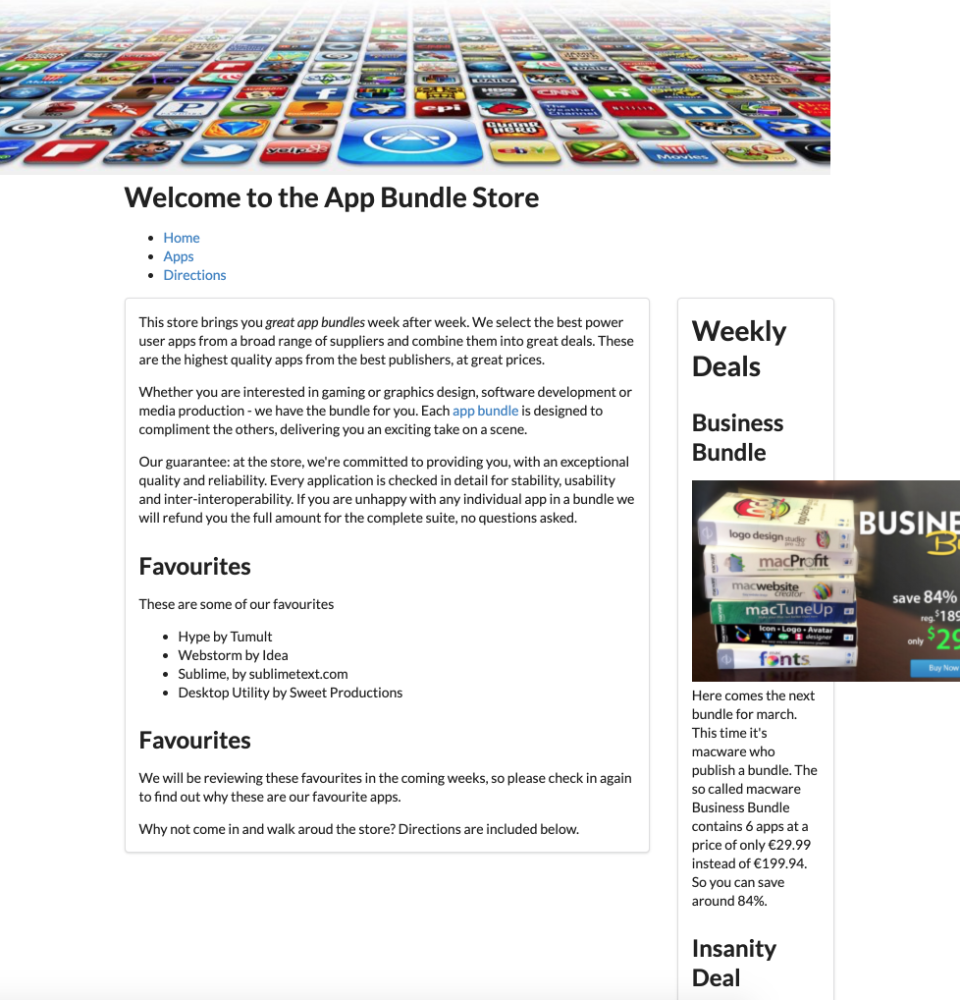

# Segment

In the framework, the segment is a key aspect of proportional layout:

- <https://fomantic-ui.com/elements/segment.html>

In index, we can make the main article a segment:

## index.ejs

~~~
  ...
      <article class="ui segment">
        

          This store brings you <em> great app bundles </em> week after week. We select the best power user apps from a
          broad range of suppliers and combine them into great deals. These are the highest quality apps from the best
 ...
~~~

Similarly in the aside:

## `_secondary.ejs`:

~~~html
<aside class="ui segment">
  <h1>Weekly Deals</h1>
  <h2 class="special">Business Bundle</h2>
  ...
~~~

This draws bounding boxes around these sections, with additional padding and margins:

There are many variations to segments presented in detail in the documentation. For instance, the 'stacked' and 'piled' variations:

- <https://fomantic-ui.com/elements/segment.html#raised>

We can make the article 'raised' and the aside 'stacked' just by including the named variant in the class:

## index.ejs

~~~html
  ...
      <article class="ui rasied segment">
        

          This store brings you <em> great app bundles </em> week after week. We select the best power user apps from a
          broad range of suppliers and combine them into great deals. These are the highest quality apps from the best
 ...
~~~

Similarly in the aside:

## `_secondary.ejs`:

~~~html
 class="ui stacked segment">
  <h1>Weekly Deals</h1>
  <h2 class="special">Business Bundle</h2>
  ...
~~~

These are subtle differences you will need to look closely to verify (try turning them on and off to see the difference)