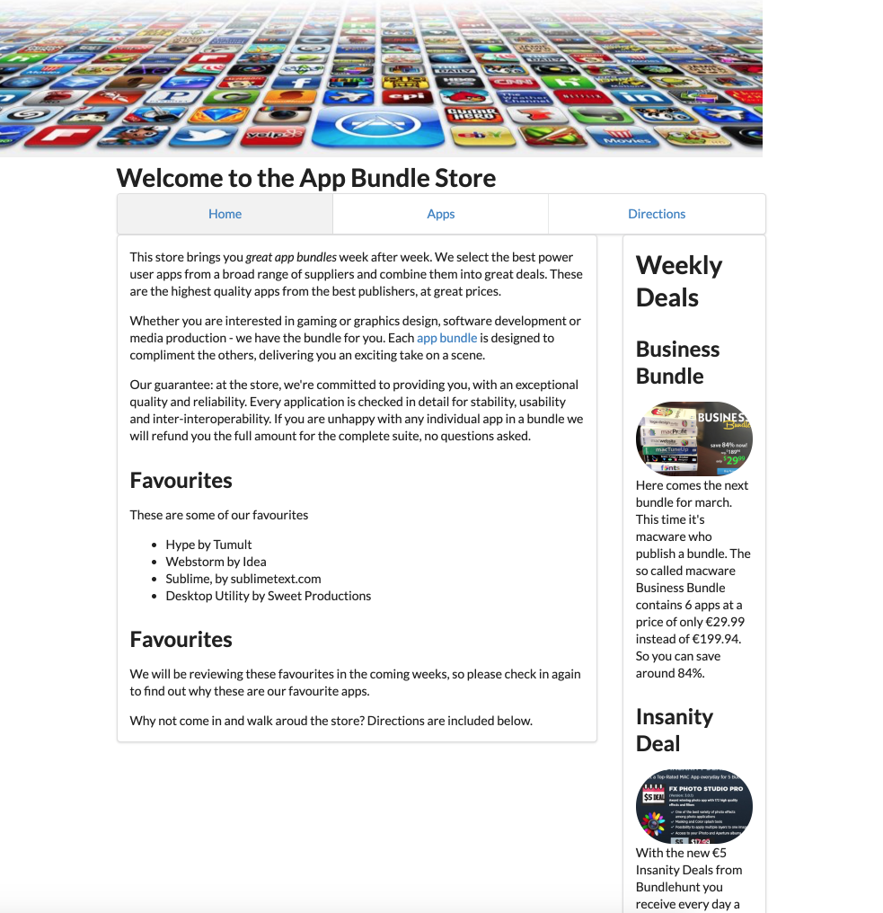

# Menus

Semantic UI includes a comprehensive set of navigation controls. The simplest one to get used to is the menu:

- <https://fomantic-ui.com/collections/menu.html>

Here is a revised version of `_nav.ejs` which uses this feature:

## `_nav.ejs`

~~~html
<nav>
  <ul class="ui three item menu">
    <li id="home" class="ui item"><a href="index.html">Home</a></li>
    <li id="apps" class="ui item"><a href="apps.html">Apps</a></li>
    <li id="directions" class="ui item"><a href="directions.html">Directions</a></li>
  </ul>
</nav>

~~~

The only changes have been to include new classes in the `<ul>` and `<lo>` elements. Try it now:

The navigation should work as before.

The tabular menu might be worth exploring:

- <https://fomantic-ui.com/collections/menu.html#tabular>

~~~html
<nav>
  <ul class="ui three item tabular menu">
~~~

